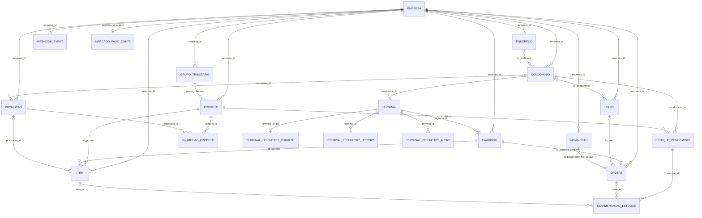

# Banco de Dados Anterior — auditoria histórica

> Este documento retrata o schema anterior à reconstrução. A fonte executável atual é [[database]].

Voltar para [[00-index]]. Recomendações e modelo alvo em [[database-melhorias]].

## Visão geral

Este documento descreve o schema **declarado pelo repositório em 30/08/2026**, depois da aplicação sequencial das migrations `V1` a `V26`, e o compara com as 20 entidades JPA e com o uso observado em repositories e services.

Escopo e limitações da fotografia:

- existem 26 arquivos SQL e 20 tabelas relacionais declaradas;
- `V26__create_terminal_telemetry.sql` existe no worktree, mas ainda não é rastreada pelo Git;
- `V20__create_condominium_stock.sql` está modificada no worktree apenas pela remoção de um comentário; embora não altere DDL, isso pode alterar o checksum Flyway;
- não foi fornecido acesso a uma instância MySQL nem à sua `flyway_schema_history`; portanto, “schema atual” significa o resultado dos arquivos presentes, não uma afirmação sobre um banco implantado específico;
- o profile `prod` usa `ddl-auto=validate`, o profile `dev` usa `ddl-auto=update` e os testes usam H2 com `create-drop` e Flyway desabilitado. O banco de desenvolvimento pode conter deriva criada pelo Hibernate, e os testes atuais não validam os scripts MySQL.

Todos os IDs das entidades são `String`. No schema final, as PKs de domínio são UUID textual em `VARCHAR(36)`, com duas exceções de comprimento: `webhook_event.id` é `VARCHAR(100)` e não há PK numérica. `terminal.id_endereco BIGINT` é uma coluna legada, não uma PK nem um campo JPA.

## Histórico Flyway

| Versão / arquivo | Objetivo e efeito final | Tabelas / constraints / índices envolvidos |
|---|---|---|
| `V1__create_table_empresa.sql` | Cria o tenant raiz e seus dados cadastrais. | Cria `empresa`; uniques globais em `cnpj`, `email`, `tenant_id`. |
| `V2__create_table_produto.sql` | Cria catálogo e saldo legado no produto. | Cria `produto`; FK `empresa_id`; `codigo` nasce UNIQUE global; `quantidade` nasce no produto. |
| `V3__create_table_carrinho.sql` | Cria carrinho associado à empresa e guarda `id_terminal` ainda sem FK. | Cria `carrinho`; FK para `empresa`. |
| `V4__create_table_item.sql` | Cria itens e primeiro snapshot de nome/preço/peso. | Cria `item`; FKs para `empresa` e `carrinho`; `id_produto` ainda sem FK. |
| `V5__create_table_user.sql` | Cria usuários autenticáveis. | Cria `users`; FK para `empresa`; uniques globais em `email` e `cpf`. |
| `V6__create_table_order.sql` | Cria pedido e campos espelho da Point. | Cria `orders`; FKs para `empresa`, `carrinho` e `users`; `id_pagamento` ainda sem FK. |
| `V7__create_table_pagamento.sql` | Cria registro financeiro de pagamento. | Cria `pagamento`; FK para `empresa`. |
| `V8__create_table_webhook_event.sql` | Cria registro relacional de webhook. | Cria `webhook_event`; FK obrigatória para `empresa`. |
| `V9__create_table_condominio.sql` | Cria condomínio. | Cria `condominio`; FK para `empresa`; `cnpj` UNIQUE global. |
| `V10__alter_table_user.sql` | Liga usuário a condomínio. | Adiciona FK `users.id_condominio`, com `ON DELETE SET NULL`. |
| `V11__create_table_terminal.sql` | Cria terminal com empresa e condomínio redundantes. | Cria `terminal`; FKs para `empresa` e `condominio`; esta última nasce com `ON DELETE CASCADE`. |
| `V12__create_table_endereco.sql` | Cria endereço por empresa. | Cria `endereco`; FK para `empresa`. |
| `V13__alter_table_condominio.sql` | Liga condomínio a endereço. | Adiciona FK `condominio.id_endereco`; não adiciona UNIQUE. |
| `V14__create_table_tributacao.sql` | Cria grupo tributário. | Cria `grupo_tributario`; FK para `empresa`; alíquotas `DECIMAL(5,2)`. |
| `V15__alter_table_produtos.sql` | Liga produto a grupo tributário. | Adiciona FK `produto.grupo_tributario`. |
| `V16__create_table_mercado_pago_conta.sql` | Persiste OAuth do Mercado Pago, inicialmente com terminal remoto na conta. | Cria `mercado_pago_conta`; FK para `empresa`. |
| `V17__alter_table_order.sql` | Liga Order ao Pagamento. | Adiciona FK `orders.id_pagamento`; não adiciona `NOT NULL` nem UNIQUE. |
| `V18__normalize_terminal_hierarchy.sql` | Normaliza `Empresa -> Condomínio -> Terminal`. | Amplia UUID para 36, renomeia `id_condominio` para `condominio_id`, remove `terminal.empresa_id` e recria FK com `ON DELETE CASCADE`. |
| `V19__separate_mercado_pago_credentials_and_terminal.sql` | Separa conta OAuth da maquininha física. | Adiciona `terminal.mercado_pago_terminal_id`; migra apenas casos inequívocos; remove `mercado_pago_conta.terminal_id`; cria uniques da conta por empresa e Point por terminal. |
| `V20__create_condominium_stock.sql` | Move saldo para condomínio e cria trilha de estoque. | Cria `estoque_condominio` e `movimentacao_estoque`; migra saldo apenas quando há um condomínio; adiciona FKs de item/produto e carrinho/terminal; torna Order única por carrinho; remove `produto.quantidade`; troca UNIQUE global do código por `(empresa_id,codigo)`. |
| `V21__add_mercado_pago_event_ordering.sql` | Guarda ordenação de eventos externos. | Adiciona `orders.mp_event_version`, `mp_event_date`; cria `idx_orders_mp_order_id`. |
| `V22__add_item_sale_snapshot.sql` | Completa snapshot comercial. | Adiciona `item.unidade_medida`. |
| `V23__align_jpa_schema.sql` | Corrige divergências conhecidas do JPA legado. | Adiciona `origin_request`; ajusta comprimentos em `orders`; renomeia `id_transaction`; adiciona `installments`; torna foto nullable; amplia descrição e UUID tributário. |
| `V24__add_catalog_sync_timestamps.sql` | Suporta sync incremental. | Adiciona timestamps ao estoque, microssegundos ao produto e índices `idx_estoque_condominio_sync` e `idx_produto_sync`. |
| `V25__create_promotions_and_financial_precision.sql` | Cria promoções, snapshot promocional e precisão financeira. | Cria `promocao` e `promocao_produto`; checks de abrangência/período/valor; migra dinheiro para `DECIMAL(15,6)`; adiciona snapshot no item e totais calculado/cobrado na Order; cria 4 índices explícitos. |
| `V26__create_terminal_telemetry.sql` | Cria estado atual, histórico e alertas da telemetria. | Cria `terminal_telemetry_current`, `terminal_telemetry_history`, `terminal_telemetry_alert`; FKs com `ON DELETE CASCADE`; cria 5 índices explícitos e UNIQUE de alerta ativo. |

Migrations que misturam transformação de dados com DDL: V19, V20 e V25. Isso não é necessariamente incorreto, mas aumenta a necessidade de teste com cópia representativa dos dados.

## Diagrama ER

O diagrama abaixo representa as **FKs físicas**, não apenas a intenção do JPA. Por isso `Endereco -> Condominio` e `Pagamento -> Orders` aparecem como relações potencialmente 1:N: as respectivas FKs não são UNIQUE.



## Empresa

**Tabela:** `empresa`
**Entidade:** `Empresa.java`
**Objetivo:** raiz do tenant e cadastro empresarial.

| Coluna SQL | Tipo / nulabilidade / default | Campo Java | Tipo Java / observação |
|---|---|---|---|
| `id` | `VARCHAR(36) NOT NULL`, PK | `id` | `String`, UUID gerado |
| `razao_social` | `VARCHAR(255) NOT NULL` | `razaoSocial` | `String`, `nullable=false` |
| `nome_fantasia` | `VARCHAR(255) NOT NULL` | `nomeFantasia` | `String`, `nullable=false` |
| `cnpj` | `VARCHAR(18) NOT NULL UNIQUE` | `cnpj` | `String`, unique |
| `email` | `VARCHAR(255) NOT NULL UNIQUE` | `email` | `String`, unique |
| `telefone` | `VARCHAR(20) NULL` | `telefone` | `String` |
| `cep` | `VARCHAR(10) NULL` | `cep` | `String` |
| `logradouro` | `VARCHAR(255) NULL` | `logradouro` | `String` |
| `numero` | `VARCHAR(20) NULL` | `numero` | `String` |
| `bairro` | `VARCHAR(100) NULL` | `bairro` | `String` |
| `cidade` | `VARCHAR(100) NULL` | `cidade` | `String` |
| `estado` | `VARCHAR(2) NULL` | `estado` | `String` |
| `tenant_id` | `VARCHAR(36) NOT NULL UNIQUE` | `tenantId` | `String`, gerado em `@PrePersist` |
| `ativo` | `BOOLEAN NOT NULL DEFAULT TRUE` | `ativo` | `Boolean`, inicial `true` |
| `data_cadastro` | `DATETIME NOT NULL DEFAULT CURRENT_TIMESTAMP` | `dataCadastro` | `LocalDateTime`, sobrescrito com `now()` em `@PrePersist` |

Não há relação de coleção mapeada a partir de `Empresa`; as relações são mantidas pelo lado filho. Empresa não possui operação de exclusão/desativação no service atual; há apenas atualização cadastral.

## Usuário

**Tabela:** `users`
**Entidade:** `auth/User.java`
**Objetivo:** identidade, autenticação, papel e vínculo opcional com condomínio.

| Coluna SQL | Tipo / nulabilidade / default | Campo Java | Tipo Java / observação |
|---|---|---|---|
| `id_user` | `VARCHAR(36) NOT NULL`, PK | `idUser` | `String`, UUID |
| `id_condominio` | `VARCHAR(36) NULL`, FK | `condominio` | `Condominio`, `@ManyToOne` EAGER por padrão |
| `nome` | `VARCHAR(100) NOT NULL` | `nome` | `String`; JPA não declara NOT NULL/length |
| `sobrenome` | `VARCHAR(100) NOT NULL` | `sobrenome` | `String`; JPA não declara NOT NULL/length |
| `email` | `VARCHAR(150) NOT NULL UNIQUE` | `email` | `String`; JPA não declara unique/length/nullability |
| `senha` | `VARCHAR(255) NOT NULL` | `senha` | `String`; JPA não declara NOT NULL |
| `cpf` | `VARCHAR(11) NOT NULL UNIQUE` | `cpf` | `String`; autenticação e busca são globais |
| `telefone` | `VARCHAR(20) NULL` | `telefone` | `String` |
| `data_nascimento` | `DATE NULL` | `dataNascimento` | `LocalDate` |
| `foto_perfil` | `TEXT NULL` | `fotoPerfil` | `String`; JPA não explicita `TEXT` |
| `ativo` | `BOOLEAN NULL DEFAULT TRUE` | `ativo` | `Boolean`; usado como soft disable e `isEnabled()` |
| `email_verificado` | `BOOLEAN NULL DEFAULT FALSE` | `emailVerificado` | `Boolean` |
| `role` | `VARCHAR(30) NOT NULL` | `role` | `RoleUser`, `EnumType.STRING` |
| `created_at` | `TIMESTAMP NULL DEFAULT CURRENT_TIMESTAMP` | `createdAt` | `LocalDateTime` |
| `updated_at` | `TIMESTAMP NULL`, auto-update | `updatedAt` | `LocalDateTime` |
| `ultimo_login` | `TIMESTAMP NULL` | `ultimoLogin` | `LocalDateTime` |
| `empresa_id` | `VARCHAR(36) NOT NULL`, FK | `empresa` | `Empresa`, LAZY e `nullable=false` |

Relações JPA: `User 1:N Order` sem cascade; `User N:1 Empresa`; `User N:1 Condominio`. O banco não garante que o condomínio e o usuário pertençam à mesma empresa. `cpf` e `email` são globais; isso é coerente com o login global atual, mas precisa ser decisão explícita do modelo de identidade.

`UserService` desativa por `ativo=false`; não há DELETE físico no fluxo observado. Vários métodos legados (`getUser`, foto, senha, atualização e listagem de orders por usuário) começam por ID global e não aplicam automaticamente `empresa_id` na query.

## Condomínio

**Tabela:** `condominio`
**Entidade:** `Condominio.java`
**Objetivo:** unidade operacional pertencente à empresa.

| Coluna SQL | Tipo / nulabilidade / default | Campo Java | Tipo Java / observação |
|---|---|---|---|
| `id_condominio` | `VARCHAR(36) NOT NULL`, PK | `idCondominio` | `String`, UUID |
| `nome` | `VARCHAR(150) NOT NULL` | `nome` | `String`; JPA não declara length/NOT NULL |
| `cnpj` | `VARCHAR(20) NULL UNIQUE` | `cnpj` | `String`; unique existe só no SQL |
| `id_endereco` | `VARCHAR(36) NULL`, FK | `endereco` | `Endereco`, `@OneToOne(cascade=ALL)` |
| `ativo` | `BOOLEAN NULL DEFAULT TRUE` | `ativo` | `Boolean`; desativação lógica |
| `created_at` | `TIMESTAMP NULL DEFAULT CURRENT_TIMESTAMP` | `createdAt` | `LocalDateTime` |
| `updated_at` | `TIMESTAMP NULL DEFAULT CURRENT_TIMESTAMP` | `updatedAt` | `LocalDateTime`; sem auto-update no SQL |
| `empresa_id` | `VARCHAR(36) NOT NULL`, FK | `empresa` | `Empresa`, LAZY e obrigatória |

A entidade diz 1:1 com endereço, mas `condominio.id_endereco` não é UNIQUE: fisicamente vários condomínios podem compartilhar o mesmo endereço. O banco também não garante `condominio.empresa_id = endereco.empresa_id`. A FK de endereço usa as ações padrão `RESTRICT/NO ACTION`.

`@Data` inclui campos de relacionamento em `equals`, `hashCode` e `toString`. Isso pode inicializar proxies e criar igualdade instável. O service usa `ativo=false`; não foi encontrado DELETE físico de condomínio.

## Produto

**Tabela:** `produto`
**Entidade:** `Produto.java`
**Objetivo:** catálogo da empresa. O saldo não reside mais nesta tabela.

| Coluna SQL | Tipo / nulabilidade / default | Campo Java | Tipo Java / observação |
|---|---|---|---|
| `id_produto` | `VARCHAR(36) NOT NULL`, PK | `idProduto` | `String`, UUID |
| `codigo` | `VARCHAR(25) NOT NULL` | `codigo` | `String`, `nullable=false` |
| `nome` | `VARCHAR(100) NOT NULL` | `nome` | `String`; JPA não declara NOT NULL/length |
| `descricao` | `VARCHAR(255) NULL` | `descricao` | `String` |
| `preco` | `DECIMAL(15,6) NOT NULL` | `preco` | `BigDecimal(15,6)` |
| `peso` | `DECIMAL(10,3) NULL` | `peso` | `BigDecimal`; precisão não declarada no JPA |
| `peso_tolerancia` | `DECIMAL(10,3) NULL` | `pesoTolerancia` | `BigDecimal`; precisão não declarada no JPA |
| `foto` | `VARCHAR(255) NULL` | `foto` | `String` |
| `categoria` | `VARCHAR(55) NULL` | `categoria` | `ProdutoCategoria`, `EnumType.STRING` |
| `unidade_medida` | `VARCHAR(50) NULL` | `unidadeMedida` | `UnidadeMedida`, `EnumType.STRING` |
| `grupo_tributario` | `VARCHAR(36) NULL`, FK | `grupoTributario` | `GrupoTributario`, LAZY |
| `ncm` | `VARCHAR(36) NULL` | — | coluna não mapeada; NCM também existe no grupo tributário |
| `create_at` | `TIMESTAMP(6) NULL DEFAULT CURRENT_TIMESTAMP(6)` | `createAt` | `LocalDateTime`, UTC explícito no callback |
| `update_at` | `TIMESTAMP(6) NULL`, default e auto-update | `updateAt` | `LocalDateTime`, UTC explícito em `@PreUpdate` |
| `status` | `BOOLEAN NULL DEFAULT TRUE` | `status` | `boolean`; desativação lógica |
| `empresa_id` | `VARCHAR(36) NOT NULL`, FK | `empresa` | `Empresa`, EAGER por padrão; JPA não marca obrigatória |

Constraints: PK e `UNIQUE(empresa_id,codigo)`. O UNIQUE global original de `codigo` foi removido na V20, portanto o código já é corretamente reutilizável entre empresas. O service também consulta e valida pelo par empresa/código.

`Produto.quantidade` existiu entre V2 e V20, foi migrado apenas para empresas com exatamente um condomínio e depois removido. A entidade atual não possui esse campo. A fonte de verdade do saldo é `estoque_condominio.quantidade`; `produto` determina apenas catálogo, preço e características.

## EstoqueCondominio

**Tabela:** `estoque_condominio`
**Entidade:** `EstoqueCondominio.java`
**Objetivo:** disponibilidade e saldo do produto em um condomínio.

| Coluna SQL | Tipo / nulabilidade / default | Campo Java | Tipo Java / observação |
|---|---|---|---|
| `id` | `VARCHAR(36) NOT NULL`, PK | `id` | `String`, UUID |
| `condominio_id` | `VARCHAR(36) NOT NULL`, FK | `condominio` | `Condominio`, LAZY e obrigatório |
| `produto_id` | `VARCHAR(36) NOT NULL`, FK | `produto` | `Produto`, LAZY e obrigatório |
| `quantidade` | `DECIMAL(15,3) NOT NULL DEFAULT 0` | `quantidade` | `BigDecimal(15,3)` |
| `ativo` | `BOOLEAN NOT NULL DEFAULT TRUE` | `ativo` | `Boolean`, disponibilidade |
| `created_at` | `TIMESTAMP(6) NOT NULL DEFAULT CURRENT_TIMESTAMP(6)` | `createdAt` | `LocalDateTime`, UTC no `@PrePersist` |
| `updated_at` | `TIMESTAMP(6) NOT NULL DEFAULT CURRENT_TIMESTAMP(6)` | `updatedAt` | `LocalDateTime`; não há `@PreUpdate` nem `ON UPDATE` |

Há `UNIQUE(condominio_id,produto_id)`, portanto não podem existir duas linhas do mesmo produto no mesmo condomínio. Não há `CHECK quantidade >= 0`: estoque negativo é permitido, e o service registra apenas um warning quando o saldo fica negativo. Disponibilidade é `ativo`, não `quantidade > 0`.

O service valida condomínio e produto no mesmo tenant antes de criar/alterar a associação. O banco, porém, possui apenas duas FKs independentes e permite, por SQL direto, ligar condomínio da Empresa A a produto da Empresa B.

Ao alterar `quantidade`, `EstoqueService.movimentar` não atualiza `updated_at`; esse timestamp é alterado explicitamente apenas na ativação/desativação ou por `touchCatalog`. Logo, o schema possui o campo de sync, mas nem toda alteração de saldo o mantém atualizado.

## Terminal

**Tabela:** `terminal`
**Entidade:** `terminal/Terminal.java`
**Objetivo:** equipamento operacional de um condomínio e vínculo com a Point.

| Coluna SQL | Tipo / nulabilidade / default | Campo Java | Tipo Java / observação |
|---|---|---|---|
| `id_terminal` | `VARCHAR(36) NOT NULL`, PK | `idTerminal` | `String`, UUID |
| `nome` | `VARCHAR(150) NULL` | `nome` | `String`; JPA default 255 |
| `codigo` | `VARCHAR(80) NULL` | `codigo` | `String`; recebe o serial no construtor |
| `serial_number` | `VARCHAR(120) NULL` | `serialNumber` | `String`; busca global por este campo |
| `mac_address` | `VARCHAR(50) NULL` | `macAddress` | `String` |
| `ip_address` | `VARCHAR(45) NULL` | `ipAddress` | `String` |
| `ativo` | `BOOLEAN NULL DEFAULT TRUE` | `ativo` | `Boolean` |
| `status` | `VARCHAR(30) NULL` | `status` | `TerminalStatus`, `EnumType.STRING` |
| `last_ping` | `TIMESTAMP NULL DEFAULT CURRENT_TIMESTAMP` | `lastPing` | `LocalDateTime` |
| `versao_software` | `VARCHAR(50) NULL` | `versaoSoftware` | `String` |
| `id_endereco` | `BIGINT NULL` | — | coluna legada sem FK e sem campo JPA |
| `condominio_id` | `VARCHAR(36) NOT NULL`, FK | `condominio` | `Condominio`, LAZY e obrigatório |
| `create_at` | `TIMESTAMP NULL DEFAULT CURRENT_TIMESTAMP` | `create_at` | `LocalDateTime`; nome Java fora de camelCase |
| `update_at` | `TIMESTAMP NULL DEFAULT CURRENT_TIMESTAMP` | `update_at` | `LocalDateTime`; atualizado manualmente |
| `mercado_pago_terminal_id` | `VARCHAR(255) NULL UNIQUE` | `mercadoPagoTerminalId` | `String`, unique no JPA e SQL |

A V18 removeu corretamente `terminal.empresa_id`; o tenant é derivado por `terminal -> condominio -> empresa`, evitando a redundância original. A FK de condomínio usa `ON DELETE CASCADE`: um DELETE físico de condomínio apaga terminais e, pela V26, também telemetria e alertas desses terminais.

Não há UNIQUE nem índice declarado para `serial_number`, apesar de `findBySerialNumber` retornar `Optional<Terminal>`. Duplicidade pode tornar a ativação ambígua. A Point possui UNIQUE global, impedindo que duas linhas de Terminal apontem para a mesma maquininha.

## Endereço

**Tabela:** `endereco`
**Entidade:** `auth/Endereco.java`
**Objetivo:** endereço reutilizado pelo cadastro de condomínio.

| Coluna SQL | Tipo / nulabilidade | Campo Java | Tipo Java / observação |
|---|---|---|---|
| `id_endereco` | `VARCHAR(36) NOT NULL`, PK | `idEndereco` | `String`, UUID |
| `rua` | `VARCHAR(255) NOT NULL` | `rua` | `String`; JPA não declara NOT NULL |
| `numero` | `VARCHAR(50) NOT NULL` | `numero` | `String` |
| `complemento` | `VARCHAR(255) NULL` | `complemento` | `String` |
| `bairro` | `VARCHAR(255) NOT NULL` | `bairro` | `String` |
| `cidade` | `VARCHAR(255) NOT NULL` | `cidade` | `String` |
| `estado` | `VARCHAR(100) NOT NULL` | `estado` | `String` |
| `cep` | `VARCHAR(20) NOT NULL` | `cep` | `String` |
| `empresa_id` | `VARCHAR(36) NOT NULL`, FK | `empresa` | `Empresa`, EAGER por padrão; JPA não marca obrigatória |

`Endereco` usa Lombok `@Data`, incluindo a associação com empresa em métodos estruturais. Não há soft delete nem timestamps. A entidade é persistida/removida por `cascade=ALL` a partir de condomínio; fisicamente o endereço pode ser compartilhado porque a FK em condomínio não é UNIQUE.

## Grupo tributário

**Tabela:** `grupo_tributario`
**Entidade:** `GrupoTributario.java`
**Objetivo:** classificação fiscal opcional do produto.

| Coluna SQL | Tipo / nulabilidade | Campo Java | Tipo Java / observação |
|---|---|---|---|
| `id_tributacao` | `VARCHAR(36) NOT NULL`, PK | `id_tributacao` | `String`, UUID; nome Java fora de camelCase |
| `descricao` | `VARCHAR(100) NULL` | `descricao` | `String` |
| `ncm` | `VARCHAR(10) NULL` | `ncm` | `String` |
| `cest` | `VARCHAR(10) NULL` | `cest` | `String` |
| `cfop` | `VARCHAR(10) NULL` | `cfop` | `String` |
| `cst` | `VARCHAR(5) NULL` | `cst` | `String` |
| `csosn` | `VARCHAR(5) NULL` | `csosn` | `String` |
| `aliquota_icms` | `DECIMAL(5,2) NULL` | `aliquotaIcms` | `BigDecimal(5,2)` |
| `aliquota_pis` | `DECIMAL(5,2) NULL` | `aliquotaPis` | `BigDecimal(5,2)` |
| `aliquota_cofins` | `DECIMAL(5,2) NULL` | `aliquotaConfins` | `BigDecimal(5,2)`; nome Java contém typo, coluna explícita correta |
| `aliquota_ipi` | `DECIMAL(5,2) NULL` | `aliquotaIpi` | `BigDecimal(5,2)` |
| `empresa_id` | `VARCHAR(36) NOT NULL`, FK | `empresa` | `Empresa`, EAGER; JPA não marca obrigatória |

Não há UNIQUE por empresa para nome/código fiscal. O banco não garante que o produto e seu grupo pertençam à mesma empresa. `produto.ncm` permanece como coluna separada e não mapeada, criando duas localizações conceituais possíveis para NCM.

## Carrinho

**Tabela:** `carrinho`
**Entidade:** `Carrinho.java`
**Objetivo:** agregado mutável da compra antes e durante o pagamento.

| Coluna SQL | Tipo / nulabilidade / default | Campo Java | Tipo Java / observação |
|---|---|---|---|
| `id_carrinho` | `VARCHAR(36) NOT NULL`, PK | `idCarrinho` | `String`, UUID |
| `id_terminal` | `VARCHAR(36) NOT NULL`, FK | `terminal` | `Terminal`, LAZY e obrigatório |
| `status` | `VARCHAR(30) NOT NULL` | `status` | `CarrinhoStatus`, `EnumType.STRING` |
| `subtotal` | `DECIMAL(15,6) NULL` | `subtotal` | `BigDecimal(15,6)` |
| `created_at` | `TIMESTAMP NULL DEFAULT CURRENT_TIMESTAMP` | `createdAt` | `LocalDateTime` |
| `updated_at` | `TIMESTAMP NULL`, auto-update | `updatedAt` | `LocalDateTime` |
| `empresa_id` | `VARCHAR(36) NOT NULL`, FK | `empresa` | `Empresa`, EAGER; JPA não marca obrigatória |

Relação JPA `Carrinho 1:N Item` usa `cascade=ALL` e `orphanRemoval=true`. A criação deriva a empresa pelo terminal e valida o contexto quando presente. O banco aceita, entretanto, `carrinho.empresa_id` diferente da empresa obtida pelo terminal.

## Order Items

**Tabela:** `item`
**Entidade:** `Item.java`
**Objetivo:** item do carrinho e snapshot comercial usado pela venda.

| Coluna SQL | Tipo / nulabilidade / default | Campo Java | Tipo Java / observação |
|---|---|---|---|
| `id_item` | `VARCHAR(36) NOT NULL`, PK | `idItem` | `String`, UUID |
| `id_produto` | `VARCHAR(36) NOT NULL`, FK | `produto` | `Produto`, LAZY e obrigatório |
| `id_carrinho` | `VARCHAR(36) NOT NULL`, FK | `carrinho` | `Carrinho`, EAGER por padrão; JPA não marca obrigatório |
| `barcode` | `VARCHAR(30) NOT NULL` | `barcode` | `String`, snapshot do código |
| `name` | `VARCHAR(100) NOT NULL` | `name` | `String`, snapshot do nome |
| `unit_price` | `DECIMAL(15,6) NOT NULL` | `unitPrice` | `BigDecimal(15,6)`, preço aplicado unitário |
| `quantity` | `INTEGER NOT NULL` | `quantity` | `Integer` |
| `requires_weight` | `BOOLEAN NOT NULL DEFAULT TRUE` | `requiresWeight` | `Boolean` |
| `foto` | `VARCHAR(255) NULL` | `foto` | `String`, snapshot visual |
| `expected_weight` | `DECIMAL(10,3) NULL` | `expectedWeight` | `BigDecimal`; precisão não declarada no JPA |
| `received_weight` | `DECIMAL(10,3) NULL` | `receivedWeight` | `BigDecimal`; precisão não declarada no JPA |
| `status` | `VARCHAR(30) NOT NULL` | `status` | `ItemStatus`, `EnumType.STRING` |
| `created_at` | `TIMESTAMP NULL DEFAULT CURRENT_TIMESTAMP` | — | coluna não mapeada |
| `updated_at` | `TIMESTAMP NULL`, auto-update | — | coluna não mapeada |
| `empresa_id` | `VARCHAR(36) NOT NULL`, FK | `empresa` | `Empresa`, EAGER; JPA não marca obrigatória |
| `unidade_medida` | `VARCHAR(30) NULL` | `unidadeMedida` | `UnidadeMedida`, snapshot como STRING |
| `original_price` | `DECIMAL(15,6) NOT NULL` | `originalPrice` | `BigDecimal(15,6)` |
| `promocao_id` | `VARCHAR(36) NULL`, FK | `promocao` | `Promocao`, LAZY |
| `promotion_type` | `VARCHAR(30) NULL` | `promotionType` | `TipoPromocao`, snapshot STRING |
| `promotion_value` | `DECIMAL(15,6) NULL` | `promotionValue` | `BigDecimal(15,6)`, snapshot |
| `calculated_discount` | `DECIMAL(15,6) NOT NULL` | `calculatedDiscount` | `BigDecimal(15,6)` |
| `calculated_subtotal` | `DECIMAL(15,6) NOT NULL` | `calculatedSubtotal` | `BigDecimal(15,6)` |

Hoje é possível responder qual era o preço original, o preço unitário aplicado, a promoção e o subtotal calculado. O histórico não depende do preço atual do produto. A FK opcional para promoção preserva referência adicional, mas os campos de snapshot evitam depender de uma promoção futura.

O item pertence à venda apenas indiretamente por `orders -> carrinho -> item`. O `orphanRemoval` do carrinho permite apagar fisicamente o snapshot se um item for removido por código após a venda; não há constraint de imutabilidade por status. `quantity` é inteiro mesmo quando a unidade do produto é `KG`, `G`, `LITRO` etc.; pesos de três casas existem, mas o total atual é preço multiplicado por quantidade inteira.

## Orders

**Tabela:** `orders`
**Entidade:** `Order.java`
**Objetivo:** pedido local, totais e espelho da order Mercado Pago.

| Coluna SQL | Tipo / nulabilidade / default | Campo Java | Tipo Java / observação |
|---|---|---|---|
| `id_order` | `VARCHAR(36) NOT NULL`, PK | `idOrder` | `String`, UUID; também é `external_reference` e chave de idempotência remota |
| `id_carrinho` | `VARCHAR(36) NOT NULL UNIQUE`, FK | `carrinho` | `Carrinho`, `@OneToOne` EAGER |
| `id_user` | `VARCHAR(36) NULL`, FK | `user` | `User`, `@ManyToOne` EAGER |
| `id_terminal` | `VARCHAR(36) NULL`, sem FK | `idTerminal` | `String`, snapshot redundante do terminal do carrinho |
| `id_pagamento` | `VARCHAR(36) NULL`, FK não UNIQUE | `pagamento` | `Pagamento`, JPA `@OneToOne(cascade=ALL)` |
| `subtotal` | `DECIMAL(15,6) NULL` | `subtotal` | `BigDecimal`, soma original |
| `desconto` | `DECIMAL(15,6) NULL` | `desconto` | `BigDecimal` |
| `total` | `DECIMAL(15,6) NULL` | `total` | `BigDecimal`; atualmente recebe total cobrado |
| `status` | `VARCHAR(20) NULL DEFAULT 'PENDING'` | `status` | `OrderStatus`, STRING |
| `created_at` | `TIMESTAMP NULL DEFAULT CURRENT_TIMESTAMP` | `createdAt` | `LocalDateTime`, JPA exige não nulo e usa `now()` |
| `updated_at` | `TIMESTAMP NULL` | `updatedAt` | `LocalDateTime`, `@PreUpdate` |
| `paid_at` | `TIMESTAMP NULL` | `paidAt` | `LocalDateTime` |
| `mp_order_id` | `VARCHAR(255) NULL`, índice não UNIQUE | `mpOrderId` | `String`, ID remoto da order Point |
| `mp_type` | `VARCHAR(50) NULL` | `mpType` | `String` |
| `mp_user_id` | `VARCHAR(255) NULL` | `mpUserId` | `String` |
| `mp_status` | `VARCHAR(50) NULL` | `mpStatus` | `OrderStatus`, STRING |
| `mp_status_detail` | `VARCHAR(50) NULL` | `mpStatusDetail` | `StatusDetail`, STRING |
| `mp_terminal_id` | `VARCHAR(100) NULL` | `mpTerminalId` | `String`, snapshot da Point |
| `empresa_id` | `VARCHAR(36) NOT NULL`, FK | `empresa` | `Empresa`, EAGER; JPA não marca obrigatória |
| `origin_request` | `VARCHAR(30) NULL` | `originRequest` | `OriginRequest`, STRING |
| `mp_event_version` | `INT NULL` | `mpEventVersion` | `Integer` |
| `mp_event_date` | `DATETIME(6) NULL` | `mpEventDate` | `LocalDateTime` |
| `total_calculado` | `DECIMAL(15,6) NULL` | `totalCalculado` | `BigDecimal`, total preciso |
| `total_cobrado` | `DECIMAL(15,6) NULL` | `totalCobrado` | `BigDecimal`, duas casas normalizadas para seis |

`id_carrinho` UNIQUE garante no máximo uma Order por carrinho. A Order não armazena `condominio_id`; ele é derivado pelo carrinho/terminal. `empresa_id` e `id_terminal` são desnormalizações: melhoram snapshot e acesso, mas o banco não impede divergência com `carrinho.empresa_id` e `carrinho.id_terminal`. `id_terminal` nem sequer possui FK.

O reconciliador busca candidates por `status`, `created_at` e `mp_order_id`, mas existe apenas índice isolado em `mp_order_id`. Orders por usuário também não possuem índice composto com data. A entidade usa `@ToString` incluindo relações, inclusive o Pagamento bidirecional.

## Pagamento

**Tabela:** `pagamento`
**Entidade:** `Pagamento.java`
**Objetivo:** estado financeiro local da tentativa atualmente vinculada à Order.

| Coluna SQL | Tipo / nulabilidade / default | Campo Java | Tipo Java / observação |
|---|---|---|---|
| `id_pagamento` | `VARCHAR(36) NOT NULL`, PK | `idPagamento` | `String`, UUID |
| `valor` | `DECIMAL(15,6) NOT NULL` | `valor` | `BigDecimal(15,6)`, recebe o total cobrado |
| `tipo` | `VARCHAR(16) NULL` | `tipo` | `PagamentoTipo`, STRING |
| `status` | `VARCHAR(30) NULL DEFAULT 'PENDING'` | `status` | `PagamentoStatus`, STRING |
| `transaction_id` | `VARCHAR(255) NULL` | `transactionId` | `String`, payment ID remoto; sem índice/UNIQUE |
| `nsu` | `VARCHAR(255) NULL` | `nsu` | `String` |
| `authorization_code` | `VARCHAR(255) NULL` | `authorizationCode` | `String` |
| `created_at` | `TIMESTAMP NULL DEFAULT CURRENT_TIMESTAMP` | `createdAt` | `LocalDateTime` |
| `paid_at` | `TIMESTAMP NULL` | `paidAt` | `LocalDateTime` |
| `updated_at` | `TIMESTAMP NULL` | `updatedAt` | `LocalDateTime` |
| `payment_method_id` | `VARCHAR(100) NULL` | `paymentMethodId` | `PaymentMethodId`, STRING |
| `status_detail` | `VARCHAR(100) NULL` | `statusDetail` | `String` |
| `empresa_id` | `VARCHAR(36) NOT NULL`, FK | `empresa` | `Empresa`, EAGER; JPA não marca obrigatória |
| `source_paiment` | `VARCHAR(16) NOT NULL` | `sourcePaiment` | `PagamentoSource`, STRING; typo persistido |
| `installments` | `INT NULL` | `installments` | `Integer` |

### Cardinalidade real Order/Pagamento

O JPA declara 1:1, com `Order` como lado dono. O schema físico declara apenas:

```text
orders.id_pagamento NULL -> pagamento.id_pagamento
```

Sem `NOT NULL` e sem UNIQUE, o banco permite:

- Order sem Pagamento;
- Pagamento sem qualquer Order apontando para ele;
- várias Orders apontando para o mesmo Pagamento;
- no máximo um Pagamento diretamente apontado por cada Order;
- nenhuma segunda tentativa preservada para a mesma Order.

Portanto, a cardinalidade física é `Pagamento 0..N Orders`, não 1:1. O fluxo Point atual reduz a janela de corrida no service: `PointPaymentPersistenceService.prepare()` cria/reutiliza Order e Pagamento e confirma ambos em transação `REQUIRES_NEW` antes do POST remoto; outra transação persiste `mp_order_id` e o estado retornado. O reconciliador também procura Orders em estados ativos com pagamento nulo. Essas proteções de aplicação não mudam o fato de que o banco aceita estados órfãos.

A chave `X-Idempotency-Key` é o `Order.idOrder` e não é persistida em coluna própria. O modelo atual não representa `tentativa 1 CANCELLED` seguida de `tentativa 2 APPROVED` na mesma Order: só existe um `id_pagamento`, e repetir a mesma Order reutiliza a mesma chave remota.

`Pagamento` e `Order` usam `@ToString` dos dois lados da associação, criando risco direto de recursão/`StackOverflowError` e de carregamento involuntário.

## Mercado Pago

**Tabela:** `mercado_pago_conta`
**Entidade:** `MercadoPagoConta.java`
**Objetivo:** credenciais OAuth e metadados de uma empresa; não representa a Point física.

| Coluna SQL | Tipo / nulabilidade | Campo Java | Tipo Java / observação |
|---|---|---|---|
| `id_mercado_conta` | `VARCHAR(36) NOT NULL`, PK | `idMercadoConta` | `String`, UUID |
| `empresa_id` | `VARCHAR(36) NOT NULL UNIQUE`, FK | `empresa` | `Empresa`, `@OneToOne` LAZY, unique |
| `access_token` | `VARCHAR(500) NOT NULL` | `accessToken` | `String`; segredo persistido |
| `refresh_token` | `VARCHAR(500) NOT NULL` | `refreshToken` | `String`; segredo persistido |
| `public_key` | `VARCHAR(500) NULL` | `publicKey` | `String` |
| `mp_user_id` | `VARCHAR(36) NOT NULL` | `mpUserId` | `String`; JPA usa comprimento default 255 |
| `token_type` | `VARCHAR(50) NULL` | `tokenType` | `String` |
| `scope` | `TEXT NULL` | `scope` | `String`, `columnDefinition=TEXT` |
| `live_mode` | `BOOLEAN NULL` | `liveMode` | `Boolean` |
| `data_criacao` | `TIMESTAMP NOT NULL` | `dataCriacao` | `LocalDateTime` |
| `data_expiracao` | `TIMESTAMP NOT NULL` | `dataExpiracao` | `LocalDateTime` |

Há uma conta por empresa. A busca de webhook resumido usa `findByMpUserId`, mas `mp_user_id` não possui índice nem UNIQUE e o repository espera resultado único. Os tokens ficam em texto simples na tabela; proteção depende de acesso ao banco e backups.

A maquininha está em `terminal.mercado_pago_terminal_id`, com UNIQUE global. A Order congela ainda `mp_terminal_id`. O payment ID fica em `pagamento.transaction_id`; a order remota fica em `orders.mp_order_id`. Nenhum dos dois IDs remotos é UNIQUE no schema.

## Movimentações de estoque

**Tabela:** `movimentacao_estoque`
**Entidade:** `MovimentacaoEstoque.java`
**Objetivo:** trilha de entrada, ajuste, reserva, venda, liberação e cancelamento.

| Coluna SQL | Tipo / nulabilidade / default | Campo Java | Tipo Java / observação |
|---|---|---|---|
| `id` | `VARCHAR(36) NOT NULL`, PK | `id` | `String`, UUID |
| `estoque_id` | `VARCHAR(36) NOT NULL`, FK | `estoque` | `EstoqueCondominio`, LAZY e obrigatório |
| `tipo` | `VARCHAR(30) NOT NULL` | `tipo` | `TipoMovimentacaoEstoque`, STRING |
| `quantidade` | `DECIMAL(15,3) NOT NULL` | `quantidade` | `BigDecimal(15,3)`, magnitude absoluta |
| `quantidade_anterior` | `DECIMAL(15,3) NOT NULL` | `quantidadeAnterior` | `BigDecimal(15,3)` |
| `quantidade_posterior` | `DECIMAL(15,3) NOT NULL` | `quantidadePosterior` | `BigDecimal(15,3)` |
| `order_id` | `VARCHAR(36) NULL`, FK | `order` | `Order`, LAZY |
| `item_id` | `VARCHAR(36) NULL`, FK | `item` | `Item`, LAZY |
| `motivo` | `VARCHAR(255) NULL` | `motivo` | `String` |
| `chave_idempotencia` | `VARCHAR(160) NOT NULL UNIQUE` | `chaveIdempotencia` | `String`; fases automáticas usam `order:item:fase` |
| `created_at` | `TIMESTAMP NOT NULL DEFAULT CURRENT_TIMESTAMP` | `createdAt` | `LocalDateTime`, inicializado com `now()` local |

Há histórico de estoque. A idempotência impede repetir a mesma fase automática. Movimentos manuais recebem chave UUID. Não existe `empresa_id`; o tenant é derivado pelo estoque. Não há índice explícito `(estoque_id,created_at)`, embora a listagem por condomínio termine ordenada por data.

## Promoções

### `promocao`

**Entidade:** `Promocao.java`
**Objetivo:** regra administrativa de preço por empresa ou condomínio.

| Coluna SQL | Tipo / nulabilidade / default | Campo Java | Tipo Java / observação |
|---|---|---|---|
| `id_promocao` | `VARCHAR(36) NOT NULL`, PK | `idPromocao` | `String`, UUID |
| `empresa_id` | `VARCHAR(36) NOT NULL`, FK | `empresa` | `Empresa`, LAZY e obrigatória |
| `condominio_id` | `VARCHAR(36) NULL`, FK | `condominio` | `Condominio`, LAZY |
| `abrangencia` | `VARCHAR(30) NOT NULL` | `abrangencia` | `AbrangenciaPromocao`, STRING |
| `nome` | `VARCHAR(150) NOT NULL` | `nome` | `String` |
| `descricao` | `VARCHAR(500) NULL` | `descricao` | `String` |
| `tipo` | `VARCHAR(30) NOT NULL` | `tipo` | `TipoPromocao`, STRING |
| `valor` | `DECIMAL(15,6) NOT NULL` | `valor` | `BigDecimal(15,6)` |
| `inicio` | `DATETIME(6) NOT NULL` | `inicio` | `LocalDateTime`, interpretado como UTC pelo service |
| `fim` | `DATETIME(6) NOT NULL` | `fim` | `LocalDateTime`, interpretado como UTC |
| `ativo` | `BOOLEAN NOT NULL DEFAULT TRUE` | `ativo` | `boolean`; soft disable |
| `prioridade` | `INT NOT NULL DEFAULT 0` | `prioridade` | `int` |
| `created_at` | `DATETIME(6) NOT NULL DEFAULT CURRENT_TIMESTAMP(6)` | `createdAt` | `LocalDateTime`, UTC no callback |
| `updated_at` | `DATETIME(6) NOT NULL DEFAULT CURRENT_TIMESTAMP(6)` | `updatedAt` | `LocalDateTime`, UTC no callback |

CHECKs: combinação empresa/condomínio conforme abrangência, `fim > inicio` e `valor >= 0`. Regras específicas (`percentual > 0 e <= 100`, desconto não gerar negativo e preço fixo menor que o normal) ficam no service. Dependendo da versão MySQL, CHECKs podem não ter sido aplicados historicamente; MySQL só passou a executá-los nas versões modernas.

O banco não garante que `condominio_id` pertença a `empresa_id`. O service usa `EmpresaContext`, valida o condomínio e todos os produtos. Não há DELETE no controller; o fluxo usa `ativo` e o item histórico referencia a promoção.

### `promocao_produto`

**Entidade:** `PromocaoProduto.java`
**Objetivo:** associação explícita N:N entre promoção e produto.

| Coluna SQL | Tipo / nulabilidade / default | Campo Java | Tipo Java / observação |
|---|---|---|---|
| `id` | `VARCHAR(36) NOT NULL`, PK | `id` | `String`, UUID |
| `promocao_id` | `VARCHAR(36) NOT NULL`, FK | `promocao` | `Promocao`, LAZY e obrigatória |
| `produto_id` | `VARCHAR(36) NOT NULL`, FK | `produto` | `Produto`, LAZY e obrigatório |
| `created_at` | `DATETIME(6) NOT NULL DEFAULT CURRENT_TIMESTAMP(6)` | `createdAt` | `LocalDateTime`, UTC no callback |

Há `UNIQUE(promocao_id,produto_id)`. A entidade declara também `idx_promocao_produto_promocao`, ausente na migration; ele seria redundante porque o UNIQUE já começa por `promocao_id`. Existe índice explícito de `produto_id`. O banco não garante que produto e promoção pertençam à mesma empresa; o service garante na escrita normal.

## Webhook

**Tabela:** `webhook_event`
**Entidade:** `WebhookEvent.java`
**Objetivo declarado:** registrar evento recebido; o fluxo ativo deduplica no Redis e não usa esta tabela.

| Coluna SQL | Tipo / nulabilidade | Campo Java | Tipo Java / observação |
|---|---|---|---|
| `id` | `VARCHAR(100) NOT NULL`, PK | `id` | `String`, UUID gerado |
| `event_id` | `VARCHAR(100) NOT NULL` | `eventId` | `String`; repository busca por ele |
| `received_at` | `TIMESTAMP NOT NULL` | `receivedAt` | `LocalDateTime` |
| `empresa_id` | `VARCHAR(36) NOT NULL`, FK | — | **não existe na entidade** |

Essa é uma divergência impeditiva se o repository for usado: um INSERT JPA não fornece a coluna NOT NULL `empresa_id`. Além disso, `event_id` não é UNIQUE nem indexado, apesar de existir `existsByEventId`. Hoje não há referência ao repository fora da própria declaração; a tabela é possivelmente obsoleta.

## Telemetria

As três entidades usam `Instant`, ao contrário do restante majoritariamente baseado em `LocalDateTime`. As FKs para Terminal usam `ON DELETE CASCADE`.

### `terminal_telemetry_current`

**Entidade:** `TerminalTelemetryCurrent.java`
**Objetivo:** uma linha por terminal, atualizada por UPSERT lógico/JPA.

| Coluna SQL | Tipo / nulabilidade | Campo Java | Tipo Java |
|---|---|---|---|
| `terminal_id` | `VARCHAR(36) NOT NULL`, PK e FK | `terminalId` + `terminal` | `String` + `Terminal`, `@MapsId` |
| `captured_at` | `DATETIME(6) NOT NULL` | `capturedAt` | `Instant` |
| `received_at` | `DATETIME(6) NOT NULL` | `receivedAt` | `Instant` |
| `operational_status` | `VARCHAR(20) NOT NULL` | `operationalStatus` | `TerminalOperationalStatus`, STRING |
| `status_reasons` | `VARCHAR(1000) NULL` | `statusReasons` | `String` |

### `terminal_telemetry_history`

**Entidade:** `TerminalTelemetryHistory.java`
**Objetivo:** amostras históricas por terminal.

| Coluna SQL | Tipo / nulabilidade | Campo Java | Tipo Java |
|---|---|---|---|
| `id` | `VARCHAR(36) NOT NULL`, PK | `id` | `String`, UUID |
| `terminal_id` | `VARCHAR(36) NOT NULL`, FK | `terminal` | `Terminal`, LAZY e obrigatório |
| `captured_at` | `DATETIME(6) NOT NULL` | `capturedAt` | `Instant` |
| `received_at` | `DATETIME(6) NOT NULL` | `receivedAt` | `Instant` |
| `operational_status` | `VARCHAR(20) NOT NULL` | `operationalStatus` | `TerminalOperationalStatus`, STRING |

As tabelas `current` e `history` contêm, além das colunas acima, o mesmo `@Embedded TerminalTelemetryMetrics`:

| Coluna SQL | Tipo SQL | Campo Java / tipo |
|---|---|---|
| `system_uptime_seconds` | `BIGINT NULL` | `systemUptimeSeconds / Long` |
| `cpu_usage_percent` | `DOUBLE NULL` | `cpuUsagePercent / Double` |
| `cpu_temperature_celsius` | `DOUBLE NULL` | `cpuTemperatureCelsius / Double` |
| `memory_used_bytes` | `BIGINT NULL` | `memoryUsedBytes / Long` |
| `memory_total_bytes` | `BIGINT NULL` | `memoryTotalBytes / Long` |
| `memory_usage_percent` | `DOUBLE NULL` | `memoryUsagePercent / Double` |
| `disk_used_bytes` | `BIGINT NULL` | `diskUsedBytes / Long` |
| `disk_total_bytes` | `BIGINT NULL` | `diskTotalBytes / Long` |
| `disk_usage_percent` | `DOUBLE NULL` | `diskUsagePercent / Double` |
| `load_average1m` | `DOUBLE NULL` | `loadAverage1m / Double` |
| `undervoltage_now` | `BOOLEAN NULL` | `undervoltageNow / Boolean` |
| `undervoltage_occurred` | `BOOLEAN NULL` | `undervoltageOccurred / Boolean` |
| `throttled_now` | `BOOLEAN NULL` | `throttledNow / Boolean` |
| `throttled_occurred` | `BOOLEAN NULL` | `throttledOccurred / Boolean` |
| `frequency_capped_now` | `BOOLEAN NULL` | `frequencyCappedNow / Boolean` |
| `frequency_capped_occurred` | `BOOLEAN NULL` | `frequencyCappedOccurred / Boolean` |
| `soft_temperature_limit_now` | `BOOLEAN NULL` | `softTemperatureLimitNow / Boolean` |
| `soft_temperature_limit_occurred` | `BOOLEAN NULL` | `softTemperatureLimitOccurred / Boolean` |
| `throttled_raw` | `VARCHAR(30) NULL` | `throttledRaw / String` |
| `network_connected` | `BOOLEAN NULL` | `networkConnected / Boolean` |
| `interface_name` | `VARCHAR(80) NULL` | `interfaceName / String` |
| `wifi_ssid` | `VARCHAR(120) NULL` | `wifiSsid / String` |
| `local_ip` | `VARCHAR(45) NULL` | `localIp / String` |
| `wifi_signal_percent` | `INT NULL` | `wifiSignalPercent / Integer` |
| `wifi_signal_quality` | `VARCHAR(20) NULL` | `wifiSignalQuality / String` |
| `backend_reachable` | `BOOLEAN NULL` | `backendReachable / Boolean` |
| `backend_latency_ms` | `BIGINT NULL` | `backendLatencyMs / Long` |
| `app_version` | `VARCHAR(60) NULL` | `appVersion / String` |
| `app_uptime_seconds` | `BIGINT NULL` | `appUptimeSeconds / Long` |
| `websocket_status` | `VARCHAR(20) NULL` | `websocketStatus / String` |
| `last_product_sync_started_at` | `DATETIME(6) NULL` | `lastProductSyncStartedAt / Instant` |
| `last_product_sync_completed_at` | `DATETIME(6) NULL` | `lastProductSyncCompletedAt / Instant` |
| `last_successful_sync_at` | `DATETIME(6) NULL` | `lastSuccessfulSyncAt / Instant` |
| `last_sync_error` | `VARCHAR(300) NULL` | `lastSyncError / String` |
| `purchase_active` | `BOOLEAN NULL` | `purchaseActive / Boolean` |
| `payment_in_progress` | `BOOLEAN NULL` | `paymentInProgress / Boolean` |
| `display_width` | `INT NULL` | `displayWidth / Integer` |
| `display_height` | `INT NULL` | `displayHeight / Integer` |
| `display_orientation` | `VARCHAR(20) NULL` | `displayOrientation / String` |

`DOUBLE` aqui mede percentuais/temperatura/load, não valores financeiros. O histórico possui retenção agendada por `received_at` e índice apropriado. A consulta de gráficos usa `(terminal_id,captured_at)`. O estado atual possui índice apenas por status; o tenant é obtido por join com Terminal e Condomínio.

### `terminal_telemetry_alert`

**Entidade:** `TerminalTelemetryAlert.java`
**Objetivo:** ciclo de abertura/resolução de alertas sem duplicação por problema ativo.

| Coluna SQL | Tipo / nulabilidade | Campo Java | Tipo Java / observação |
|---|---|---|---|
| `id` | `VARCHAR(36) NOT NULL`, PK | `id` | `String`, UUID |
| `terminal_id` | `VARCHAR(36) NOT NULL`, FK | `terminal` | `Terminal`, LAZY |
| `type` | `VARCHAR(40) NOT NULL` | `type` | `TelemetryAlertType`, STRING |
| `status` | `VARCHAR(20) NOT NULL` | `status` | `TelemetryAlertStatus`, STRING |
| `message` | `VARCHAR(300) NOT NULL` | `message` | `String` |
| `opened_at` | `DATETIME(6) NOT NULL` | `openedAt` | `Instant` |
| `last_observed_at` | `DATETIME(6) NOT NULL` | `lastObservedAt` | `Instant` |
| `resolved_at` | `DATETIME(6) NULL` | `resolvedAt` | `Instant` |
| `active_key` | `VARCHAR(90) NULL UNIQUE` | `activeKey` | `String`; fica nula ao resolver |

O UNIQUE permite vários `NULL` em MySQL e impede duplicar uma chave ativa. As queries procuram `(terminal_id,type,status)` e `(terminal_id,status,opened_at)`, enquanto os índices atuais são separados/alternativos e não cobrem exatamente esses predicados.

## Enums persistidos

Todos os enums encontrados em entidades usam `EnumType.STRING`; não há enum ordinal persistido.

| Tabela.coluna | Enum | Valores atuais |
|---|---|---|
| `users.role` | `RoleUser` | `ADMIN`, `GERENTE`, `PORTARIA`, `MORADOR`, `USER` |
| `produto.unidade_medida` | `UnidadeMedida` | `UN`, `KG`, `G`, `LITRO`, `ML`, `CAIXA`, `PACOTE`, `FARDO`, `BANDEJA`, `GARRAFA`, `LATA`, `SACO`, `DUZIA`, `METRO` |
| `produto.categoria` | `ProdutoCategoria` | catálogo de categorias em texto |
| `carrinho.status` | `CarrinhoStatus` | `OPEN`, `WAITING_WEIGHT`, `READY_FOR_PAYMENT`, `PAYMENT_PENDING`, `PAID`, `CANCELED` |
| `item.status` | `ItemStatus` | `WAITING_WEIGHT`, `VALIDATED`, `INVALID_WEIGHT`, `REMOVED` |
| `item.promotion_type`, `promocao.tipo` | `TipoPromocao` | `PERCENTUAL`, `DESCONTO_FIXO`, `PRECO_FIXO` |
| `orders.origin_request` | `OriginRequest` | `TERMINAL`, `APP` |
| `orders.status`, `orders.mp_status` | `OrderStatus` | `PENDING`, `CREATED`, `AT_TERMINAL`, `PROCESSED`, `CANCELED`, `EXPIRED`, `FAILED`, `REFUNDED`, `ACTION_REQUIRED` |
| `orders.mp_status_detail` | `StatusDetail` | detalhes Point persistidos pelo nome Java |
| `pagamento.status` | `PagamentoStatus` | `PENDING`, `PROCESSED`, `CANCELED`, `EXPIRED`, `FAILED`, `REFUNDED`, `ACTION_REQUIRED` |
| `pagamento.tipo` | `PagamentoTipo` | `PIX`, `CREDIT_CARD`, `DEBIT_CARD`, `ALIMENT_CARD` |
| `pagamento.source_paiment` | `PagamentoSource` | `TERMINAL`, `CHECKOUT` |
| `pagamento.payment_method_id` | `PaymentMethodId` | nomes Java como `VISA`, `MASTER`, `PIX` |
| `movimentacao_estoque.tipo` | `TipoMovimentacaoEstoque` | `ENTRADA`, `AJUSTE`, `RESERVA`, `VENDA`, `LIBERACAO_RESERVA`, `CANCELAMENTO` |
| `promocao.abrangencia` | `AbrangenciaPromocao` | `EMPRESA`, `CONDOMINIO` |
| telemetria | enums de status/alerta | `SAUDAVEL`, `ATENCAO`, `CRITICO`, `OFFLINE`, `ACTIVE`, `RESOLVED` e tipos de alerta |

Os `@JsonValue` de alguns enums do Mercado Pago usam valores minúsculos externos, mas JPA persiste o **nome do enum**, pois usa `EnumType.STRING`.

## Índices

### Índices explicitamente declarados

Além das 20 PKs e dos índices que sustentam UNIQUEs, as migrations criam estes 12 índices por `CREATE INDEX`:

| Índice | Tabela / colunas | Uso observado |
|---|---|---|
| `idx_orders_mp_order_id` | `orders(mp_order_id)` | diagnóstico/busca por ID remoto; as queries atuais de reconciliação não começam por esse campo |
| `idx_estoque_condominio_sync` | `estoque_condominio(condominio_id,updated_at)` | sync incremental por condomínio |
| `idx_produto_sync` | `produto(update_at)` | mudanças de catálogo por data |
| `idx_promocao_empresa_periodo` | `promocao(empresa_id,ativo,inicio,fim)` | preço e listagem por empresa/período |
| `idx_promocao_condominio_periodo` | `promocao(condominio_id,ativo,inicio,fim)` | preço por condomínio/período |
| `idx_promocao_produto_produto` | `promocao_produto(produto_id)` | promoções por produto |
| `idx_item_promocao` | `item(promocao_id)` | histórico/vendas da promoção |
| `idx_telemetry_current_status` | `terminal_telemetry_current(operational_status)` | filtro global por estado operacional |
| `idx_telemetry_history_terminal_captured` | `terminal_telemetry_history(terminal_id,captured_at)` | séries temporais |
| `idx_telemetry_history_received` | `terminal_telemetry_history(received_at)` | retenção |
| `idx_telemetry_alert_terminal_opened` | `terminal_telemetry_alert(terminal_id,opened_at)` | histórico do terminal |
| `idx_telemetry_alert_status` | `terminal_telemetry_alert(status)` | alertas por estado |

### Índices de PK e UNIQUE

- toda PK gera índice único;
- `empresa`: `cnpj`, `email`, `tenant_id`;
- `users`: `email`, `cpf`;
- `condominio`: `cnpj`;
- `produto`: `(empresa_id,codigo)`;
- `orders`: `id_carrinho`;
- `mercado_pago_conta`: `empresa_id`;
- `terminal`: `mercado_pago_terminal_id`;
- `estoque_condominio`: `(condominio_id,produto_id)`;
- `movimentacao_estoque`: `chave_idempotencia`;
- `promocao_produto`: `(promocao_id,produto_id)`;
- `terminal_telemetry_alert`: `active_key`.

MySQL exige índice para uma FK e pode criar automaticamente um índice quando não existe um prefixo adequado. Esses índices implícitos dependem do engine/versão e seus nomes só podem ser confirmados com `SHOW INDEX` na instância; as migrations não os nomeiam como índices independentes.

## Constraints

### Foreign keys

Há 34 FKs declaradas. Quando `ON DELETE`/`ON UPDATE` não aparece abaixo, vale a ação padrão do MySQL (`RESTRICT`/`NO ACTION`); nenhuma migration declara `ON UPDATE CASCADE`.

| Origem | Destino | Coluna nullable | ON DELETE |
|---|---|---:|---|
| `produto.empresa_id` | `empresa.id` | não | padrão |
| `produto.grupo_tributario` | `grupo_tributario.id_tributacao` | sim | padrão |
| `carrinho.empresa_id` | `empresa.id` | não | padrão |
| `carrinho.id_terminal` | `terminal.id_terminal` | não | padrão |
| `item.empresa_id` | `empresa.id` | não | padrão |
| `item.id_carrinho` | `carrinho.id_carrinho` | não | padrão |
| `item.id_produto` | `produto.id_produto` | não | padrão |
| `item.promocao_id` | `promocao.id_promocao` | sim | padrão |
| `users.empresa_id` | `empresa.id` | não | padrão |
| `users.id_condominio` | `condominio.id_condominio` | sim | `SET NULL` |
| `orders.empresa_id` | `empresa.id` | não | padrão |
| `orders.id_carrinho` | `carrinho.id_carrinho` | não | padrão |
| `orders.id_user` | `users.id_user` | sim | padrão |
| `orders.id_pagamento` | `pagamento.id_pagamento` | sim | padrão |
| `pagamento.empresa_id` | `empresa.id` | não | padrão |
| `webhook_event.empresa_id` | `empresa.id` | não | padrão |
| `condominio.empresa_id` | `empresa.id` | não | padrão |
| `condominio.id_endereco` | `endereco.id_endereco` | sim | padrão |
| `terminal.condominio_id` | `condominio.id_condominio` | não | `CASCADE` |
| `endereco.empresa_id` | `empresa.id` | não | padrão |
| `grupo_tributario.empresa_id` | `empresa.id` | não | padrão |
| `mercado_pago_conta.empresa_id` | `empresa.id` | não | padrão |
| `estoque_condominio.condominio_id` | `condominio.id_condominio` | não | padrão |
| `estoque_condominio.produto_id` | `produto.id_produto` | não | padrão |
| `movimentacao_estoque.estoque_id` | `estoque_condominio.id` | não | padrão |
| `movimentacao_estoque.order_id` | `orders.id_order` | sim | padrão |
| `movimentacao_estoque.item_id` | `item.id_item` | sim | padrão |
| `promocao.empresa_id` | `empresa.id` | não | padrão |
| `promocao.condominio_id` | `condominio.id_condominio` | sim | padrão |
| `promocao_produto.promocao_id` | `promocao.id_promocao` | não | padrão |
| `promocao_produto.produto_id` | `produto.id_produto` | não | padrão |
| `terminal_telemetry_current.terminal_id` | `terminal.id_terminal` | não/PK | `CASCADE` |
| `terminal_telemetry_history.terminal_id` | `terminal.id_terminal` | não | `CASCADE` |
| `terminal_telemetry_alert.terminal_id` | `terminal.id_terminal` | não | `CASCADE` |

### CHECKs

Só `promocao` possui CHECKs explícitos:

- `ck_promocao_abrangencia`;
- `ck_promocao_periodo`;
- `ck_promocao_valor`.

Não há CHECK para quantidade de item positiva, preço não negativo, totais coerentes, percentuais máximos, estado da Order/Pagamento ou consistência multi-tenant. Não há CHECK impedindo estoque negativo, o que está correto para a regra atual.

## Precisão financeira

### Campos monetários

Após a V25, todos os campos monetários internos persistidos usam `DECIMAL(15,6)` e `BigDecimal`:

| Campo | SQL atual | Java | Papel |
|---|---|---|---|
| `Produto.preco` | `DECIMAL(15,6) NOT NULL` | `BigDecimal` | preço de catálogo |
| `Promocao.valor` | `DECIMAL(15,6) NOT NULL` | `BigDecimal` | percentual/desconto/preço fixo |
| `Carrinho.subtotal` | `DECIMAL(15,6) NULL` | `BigDecimal` | total preciso corrente |
| `Item.unitPrice` | `DECIMAL(15,6) NOT NULL` | `BigDecimal` | preço unitário aplicado |
| `Item.originalPrice` | `DECIMAL(15,6) NOT NULL` | `BigDecimal` | preço original congelado |
| `Item.promotionValue` | `DECIMAL(15,6) NULL` | `BigDecimal` | valor da regra congelado |
| `Item.calculatedDiscount` | `DECIMAL(15,6) NOT NULL` | `BigDecimal` | desconto congelado |
| `Item.calculatedSubtotal` | `DECIMAL(15,6) NOT NULL` | `BigDecimal` | subtotal congelado |
| `Order.subtotal` | `DECIMAL(15,6) NULL` | `BigDecimal` | soma original |
| `Order.desconto` | `DECIMAL(15,6) NULL` | `BigDecimal` | desconto total |
| `Order.totalCalculado` | `DECIMAL(15,6) NULL` | `BigDecimal` | total preciso |
| `Order.totalCobrado` | `DECIMAL(15,6) NULL` | `BigDecimal` | valor cobrado, ex. `22.640000` |
| `Order.total` | `DECIMAL(15,6) NULL` | `BigDecimal` | atualmente espelha total cobrado |
| `Pagamento.valor` | `DECIMAL(15,6) NOT NULL` | `BigDecimal` | valor efetivamente cobrado |

Não foi encontrado `double`/`float` em entidade ou cálculo financeiro. Os `Double` do projeto pertencem à telemetria. Alíquotas tributárias usam `DECIMAL(5,2)`/`BigDecimal`; são percentuais fiscais, não dinheiro, e ficaram fora da migração monetária.

`MoneyPolicy` centraliza escala persistida 6, cálculo 12 e cobrança 2 com `HALF_UP`. `Order.totalCalculado` e `Order.totalCobrado` tornam possível distinguir total preciso e cobrado. O campo legado `Order.total` continua redundante com o cobrado e pode divergir por escrita externa.

### Quantidades e peso

| Campo | SQL | Java | Semântica |
|---|---|---|---|
| `estoque_condominio.quantidade` | `DECIMAL(15,3)` | `BigDecimal(15,3)` | saldo; aceita negativo |
| três quantidades de `movimentacao_estoque` | `DECIMAL(15,3)` | `BigDecimal(15,3)` | trilha de saldo |
| `produto.peso`, `peso_tolerancia` | `DECIMAL(10,3)` | `BigDecimal` sem precisão JPA | atributos físicos |
| `item.expected_weight`, `received_weight` | `DECIMAL(10,3)` | `BigDecimal` sem precisão JPA | validação de balança |
| `item.quantity` | `INTEGER` | `Integer` | quantidade vendida inteira |

O estoque já segue a escala alvo de três casas. Pesos têm apenas 7 dígitos inteiros (`DECIMAL(10,3)`) e o mapping JPA não declara escala. A modelagem da venda não possui quantidade fracionada; unidades potencialmente fracionáveis não alteram a multiplicação por inteiro.

## Datas e horários

O schema mistura:

- `TIMESTAMP` sem fração na maior parte do legado;
- `DATETIME` em `empresa.data_cadastro`;
- `TIMESTAMP(6)` no sync de produto/estoque;
- `DATETIME(6)` em promoções, eventos Mercado Pago e telemetria;
- `DATE` para nascimento.

O Java mistura `LocalDateTime.now()` no fuso da JVM, `LocalDateTime.now(ZoneOffset.UTC)` e `Instant`. Não há `hibernate.jdbc.time_zone` configurado. Defaults `CURRENT_TIMESTAMP` usam a sessão do banco. Em particular:

- produto, estoque e promoções tratam seus `LocalDateTime` como UTC explicitamente;
- Empresa, User, Condomínio, Terminal, Carrinho, Order, Pagamento, MercadoPagoConta e movimentações usam hora local da JVM;
- telemetria usa `Instant`, mas persiste em `DATETIME(6)`, tipo sem fuso embutido;
- `PaymentStateTransitionService` converte `OffsetDateTime` para `LocalDateTime` com `toLocalDateTime()`, descartando o offset em vez de normalizar para UTC;
- vários `updated_at` dependem de `ON UPDATE`, outros de callbacks/services e outros não são atualizados em toda mutação.

Não existe política temporal única comprovável no banco atual.

## Cascades, fetch e Lombok

### Cascades físicos

Somente três relações de terminal/telemetria e `terminal -> condominio` usam `ON DELETE CASCADE`; usuário/condomínio usa `SET NULL`. As demais FKs restringem DELETE por padrão.

### Cascades JPA

- `Condominio.endereco`: `CascadeType.ALL`; remover condomínio pelo JPA pode remover endereço;
- `Carrinho.items`: `CascadeType.ALL` + `orphanRemoval=true`; remover item da coleção apaga a linha;
- `Order.pagamento`: `CascadeType.ALL`; remover Order pode remover o registro financeiro;
- `Promocao.produtos`: `CascadeType.ALL` + `orphanRemoval=true`; associações são apagadas na edição.

Os cascades de Carrinho/Item e Order/Pagamento são sensíveis por incidirem sobre snapshots financeiros. Não foram encontrados DELETEs físicos nos services atuais, mas o mapping não impede um futuro uso acidental.

### Fetch

Associações com LAZY explícito: empresa de Condomínio/User, condomínio de Terminal, produto/grupo, estoque, promoção/produtos, telemetria e movimentações. Permanecem EAGER por default JPA várias relações importantes: `Carrinho.empresa`, `Item.empresa/carrinho`, `Order.empresa/carrinho/user/pagamento`, `Pagamento.empresa/order`, `Endereco.empresa`, `GrupoTributario.empresa`, `Condominio.endereco` e `User.condominio`.

Isso pode produzir joins/cargas inesperadas. Repositories específicos usam `EntityGraph` no reconciliador, mas listagens gerais dependem do comportamento default e podem sofrer N+1.

### Lombok

- `Condominio`, `Endereco` e `Terminal` usam `@Data`, incluindo relações e campos mutáveis em `equals/hashCode/toString`;
- `Order` e `Pagamento` usam `@ToString` em uma relação bidirecional;
- `WebhookEvent` limita `equals/hashCode` ao ID, padrão mais seguro.

Há risco de recursão, lazy loading fora de transação, `StackOverflowError` e hash instável nas entidades que incluem relações.

## Hierarquia multi-tenant e redundâncias

A hierarquia principal está normalizada:

```text
Empresa -> Condominio -> Terminal
Empresa -> Produto
Condominio + Produto -> EstoqueCondominio
```

`Terminal` não possui mais `empresa_id`, o que evita uma redundância perigosa. Em contrapartida, agregados comerciais duplicam o tenant e/ou terminal para acesso/snapshot:

- `carrinho`: `empresa_id` + `id_terminal`;
- `item`: `empresa_id` + carrinho + produto + promoção;
- `orders`: `empresa_id` + carrinho + `id_terminal` escalar + usuário + pagamento;
- `pagamento`: `empresa_id`, mas o vínculo com Order está do outro lado;
- `users`: empresa + condomínio;
- `produto`: empresa + grupo tributário;
- `promocao`: empresa + condomínio; associação a produtos;
- `endereco`: empresa; condomínio aponta para ele;
- `estoque_condominio`: condomínio + produto.

Nenhuma dessas combinações usa FK composta que garanta o mesmo `empresa_id`. Os services tenant-aware validam os caminhos administrativos de empresa, condomínio, terminal, produto, estoque, promoção e criação do carrinho. Carrinho/Order/Pagamento ainda possuem métodos globais usados pelo Terminal, webhook e scheduler; eles fazem validações pontuais, mas não existe filtro automático de tenant nem row-level security.

A segurança HTTP atual permite todas as requisições (`anyRequest().permitAll()`); quando há JWT, `SecurityFilter` popula `EmpresaContext`. Assim, isolamento depende de cada service exigir/validar o contexto. Queries legadas de User e Order por ID/usuário não incluem empresa por padrão.

## Soft delete e ciclo de vida

| Recurso | Estratégia observada |
|---|---|
| Empresa | possui `ativo`, mas não há método de desativação observado |
| User | `ativo=false`; autenticação respeita `isEnabled()` |
| Condominio | `ativo=false` pelo service |
| Terminal | possui `ativo` e status, mas não há DELETE; offline altera apenas status |
| Produto | `status=false` pelo service |
| EstoqueCondominio | `ativo=false`; linha e histórico são preservados |
| Promocao | `ativo=false`; não há endpoint DELETE |
| Carrinho/Order/Pagamento | estados de domínio; sem DELETE no fluxo normal |
| Telemetria history | DELETE físico por retenção configurada |

Apesar do comportamento atual, não há annotations como `@SQLDelete`/filtro global. Repositories continuam expondo `delete*`; os FKs e cascades determinam o resultado se forem chamados.

## Colunas possivelmente obsoletas ou sem uso

Confirmadas por busca de referências:

- `terminal.id_endereco`: não mapeada e sem FK;
- `produto.ncm`: não mapeada; NCM mapeado existe em `grupo_tributario`;
- `item.created_at` e `item.updated_at`: não mapeadas;
- `webhook_event.empresa_id`: exigida no banco, ausente na entidade;
- a entidade/repository/tabela `WebhookEvent` não participam do fluxo ativo, que usa Redis;
- `orders.total` é funcional, mas hoje duplica `total_cobrado`;
- `orders.id_terminal` duplica o terminal derivável do carrinho, embora funcione como snapshot e seja usado no envio Point.

“Possivelmente obsoleto” não significa seguro para remoção: é necessário conferir dados e consumidores externos antes de qualquer migration.

## Divergências JPA x schema

| Severidade | Divergência factual |
|---|---|
| impeditiva se usada | `webhook_event.empresa_id NOT NULL` não existe em `WebhookEvent` |
| cardinalidade | `Order.pagamento` é `@OneToOne`, mas `orders.id_pagamento` não é UNIQUE |
| cardinalidade | `Condominio.endereco` é `@OneToOne`, mas `condominio.id_endereco` não é UNIQUE |
| coluna extra | `terminal.id_endereco`, `produto.ncm` e timestamps de `item` não são mapeados |
| comprimento | `empresa.tenant_id VARCHAR(36)` e `mercado_pago_conta.mp_user_id VARCHAR(36)` versus `String` JPA default 255 |
| comprimento | vários campos de Terminal, User, GrupoTributario e Order têm limites SQL menores que o default JPA 255 |
| precisão | pesos são `DECIMAL(10,3)`, mas os campos `BigDecimal` não declaram precision/scale |
| nullability | várias FKs NOT NULL (`produto/carrinho/item/order/pagamento/endereco/grupo -> empresa`) não são obrigatórias no mapping JPA |
| nullability | `produto.status` é `boolean` Java, mas a coluna permite NULL |
| restrições só SQL | uniques de User e Condomínio não aparecem nas entidades |
| restrição só JPA | índice `idx_promocao_produto_promocao` aparece na entidade, mas não na migration; o UNIQUE já cobre o prefixo |
| naming | coexistem `created_at`, `create_at`, `data_cadastro`, `source_paiment`, `id_*` e PK genérica `id` |

O SQL é mais estrito que o JPA em vários campos de texto NOT NULL. Isso não corrompe dados por si só, mas permite montar uma entidade inválida e descobrir o erro somente no flush.

A execução de `mvn test` confirmou que o schema H2 gerado pelo JPA não equivale às migrations: H2 criou UNIQUE automático em `orders.id_pagamento` e `condominio.id_endereco`, gerou pesos como `NUMERIC(38,2)`, omitiu `webhook_event.empresa_id` e usou vários `VARCHAR(255)` onde o MySQL declarado possui limites menores. Portanto os testes de repository validam o mapping JPA, não o schema MySQL descrito neste documento.

## Funcionamento real nos repositories e services

- Produto: queries sempre combinam código/ID com empresa; UNIQUE composto sustenta o acesso.
- Estoque: listagens administrativas filtram condomínio e empresa; o lock usa apenas `(condominio,produto)` depois de validação de tenant no service.
- Sync: catálogo atual usa condomínio, `ativo=true` e produto ativo; quantidade não determina disponibilidade.
- Terminal: administração usa caminhos tenant-aware, mas ativação e heartbeat procuram terminal globalmente por serial/ID.
- Order: uma Order por carrinho é garantida; busca por ID, lock, status e reconciliação são globais e validados conforme o chamador.
- Pagamento: `findByTransactionId` espera unicidade lógica que o banco não garante.
- Mercado Pago: `findByMpUserId` espera unicidade lógica que o banco não garante.
- Reconciliation: procura Orders recentes em estados `PENDING`, `CREATED`, `AT_TERMINAL`, `ACTION_REQUIRED`, com `mp_order_id`; também procura Orders nesses estados sem Pagamento.
- Telemetria: current é uma linha por terminal; histórico usa range de `captured_at`; retenção usa `received_at`.

## Problemas encontrados

Este documento registra os fatos principais; classificação e propostas completas estão em [[database-melhorias]].

1. O schema não implementa a cardinalidade JPA Order/Pagamento nem múltiplas tentativas; estados órfãos continuam fisicamente possíveis.
2. IDs remotos críticos (`transaction_id`, `mp_order_id`, `mp_user_id`) não têm a unicidade/índices esperados pelos repositories e pela reconciliação.
3. O banco não garante consistência de tenant nas relações compostas; a proteção depende de services, e há caminhos globais.
4. `WebhookEvent` não pode ser persistido conforme entidade/migration atuais e está fora do fluxo ativo.
5. O padrão temporal mistura fuso local, UTC, `Instant`, `TIMESTAMP` e `DATETIME`.
6. A V20 foi modificada localmente e V26 ainda não está rastreada; não há teste automatizado que aplique Flyway/MySQL.
7. Relações 1:1 sem UNIQUE, cascades financeiros e Lombok relacional criam riscos de integridade/runtime.
8. O modelo de item preserva preço histórico, mas o snapshot permanece fisicamente dependente de Carrinho e de `orphanRemoval`.
9. Estoque possui trilha e UNIQUE corretos, mas `updated_at` não é atualizado em toda mudança de quantidade.
10. Quantidade de venda é inteira, embora o catálogo suporte unidades potencialmente fracionárias.
