# Diagrama ER do banco reconstruído

```mermaid
erDiagram
    EMPRESA ||--o{ ENDERECO : possui
    EMPRESA ||--o{ CONDOMINIO : opera
    ENDERECO ||--o| CONDOMINIO : localiza
    EMPRESA ||--o{ USERS : autentica
    CONDOMINIO ||--o{ USERS : associa
    CONDOMINIO ||--o{ TERMINAL : possui
    EMPRESA ||--o{ PRODUTO : cataloga
    PRODUTO ||--o{ PRODUTO_CODIGO_BARRAS : identifica
    PRODUTO ||--o| PRODUTO_FISCAL : classifica
    EMPRESA ||--o{ PERFIL_TRIBUTARIO : configura
    PERFIL_TRIBUTARIO ||--o{ PRODUTO_FISCAL : referencia
    CONDOMINIO ||--o{ ESTOQUE_CONDOMINIO : disponibiliza
    PRODUTO ||--o{ ESTOQUE_CONDOMINIO : saldo
    EMPRESA ||--o{ ESTOQUE_EMPRESA : armazena
    PRODUTO ||--o{ ESTOQUE_EMPRESA : saldo_central
    EMPRESA ||--o{ PLANOGRAMA : organiza
    PLANOGRAMA ||--o{ PLANOGRAMA_POSICAO : divide
    PLANOGRAMA_POSICAO ||--o{ PLANOGRAMA_PRODUTO : posiciona
    PRODUTO ||--o{ PLANOGRAMA_PRODUTO : localiza
    EMPRESA ||--o{ TRANSFERENCIA_ESTOQUE : movimenta
    TRANSFERENCIA_ESTOQUE ||--|{ TRANSFERENCIA_ESTOQUE_ITEM : contem
    PRODUTO ||--o{ TRANSFERENCIA_ESTOQUE_ITEM : transfere
    EMPRESA ||--o{ INVENTARIO : realiza
    INVENTARIO ||--|{ INVENTARIO_ITEM : contem
    PRODUTO ||--o{ INVENTARIO_ITEM : conta
    ESTOQUE_EMPRESA ||--o{ INVENTARIO_ITEM : snapshot_central
    ESTOQUE_CONDOMINIO ||--o{ INVENTARIO_ITEM : snapshot_condominio
    INVENTARIO ||--o{ MOVIMENTACAO_ESTOQUE : ajusta
    INVENTARIO_ITEM ||--o{ MOVIMENTACAO_ESTOQUE : origina
    EMPRESA ||--o{ IMPORTACAO_PRODUTO : importa
    IMPORTACAO_PRODUTO ||--|{ IMPORTACAO_PRODUTO_ITEM : valida
    PRODUTO ||--o{ IMPORTACAO_PRODUTO_ITEM : resulta
    EMPRESA ||--o{ PROMOCAO : cria
    CONDOMINIO ||--o{ PROMOCAO : restringe
    PROMOCAO ||--o{ PROMOCAO_PRODUTO : inclui
    PRODUTO ||--o{ PROMOCAO_PRODUTO : participa
    TERMINAL ||--o{ CARRINHO : abre
    CARRINHO ||--o{ CART_ITEM : contem
    PRODUTO ||--o{ CART_ITEM : referencia
    CARRINHO ||--o| ORDERS : origina
    ORDERS ||--|{ ORDER_ITEM : congela
    PRODUTO ||--o{ ORDER_ITEM : referencia
    ESTOQUE_CONDOMINIO ||--o{ MOVIMENTACAO_ESTOQUE : registra
    ESTOQUE_EMPRESA ||--o{ MOVIMENTACAO_ESTOQUE : registra
    TRANSFERENCIA_ESTOQUE ||--o{ MOVIMENTACAO_ESTOQUE : vincula
    ORDERS ||--o{ MOVIMENTACAO_ESTOQUE : causa
    ORDER_ITEM ||--o{ MOVIMENTACAO_ESTOQUE : detalha
    ORDERS ||--o{ PAYMENT_ATTEMPT : tenta
    PAYMENT_ATTEMPT ||--o{ PAYMENT_EVENT : recebe
    EMPRESA ||--o{ MERCADO_PAGO_CONTA : historico_autorizacao
    MERCADO_PAGO_CONTA ||--o| MERCADO_PAGO_CONTA_ATIVA : lease_ativo
    EMPRESA ||--o| MERCADO_PAGO_CONTA_ATIVA : possui_ativa
    MERCADO_PAGO_CONTA ||--o{ TERMINAL_POINT_BINDING : autoriza_point
    TERMINAL ||--o{ TERMINAL_POINT_BINDING : historico_point
    PAYMENT_ATTEMPT ||--o{ WEBHOOK_EVENT : resolve
    TERMINAL ||--o| TERMINAL_TELEMETRY_CURRENT : estado
    TERMINAL ||--o{ TERMINAL_TELEMETRY_HISTORY : amostra
    TERMINAL ||--o{ TERMINAL_TELEMETRY_ALERT : alerta
    EMPRESA ||--o{ AUDIT_LOG : audita
```

As ligações de tenant não aparecem repetidas no desenho. No SQL, as relações críticas usam `(id, empresa_id)` para impedir `Condominio A + Produto B`, promoção cross-tenant, item de outro catálogo ou pagamento associado a Order de outra empresa.
