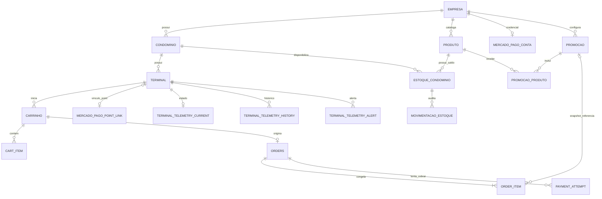

# Melhorias do Banco Anterior — referência histórica

> As recomendações deste diagnóstico deram origem à baseline descrita em [[database]]. Algumas pendências deliberadas continuam listadas na documentação nova.

Voltar para [[00-index]]. Fotografia factual em [[database-atual]].

## Como ler este documento

Este arquivo separa deliberadamente fato e recomendação. Nenhuma proposta abaixo foi implementada nesta auditoria. Prioridades:

- **CRÍTICA:** pode causar cobrança/histórico incorreto, violação de tenant ou perda material de integridade;
- **ALTA:** risco operacional relevante, deriva de schema ou gargalo em fluxo central;
- **MÉDIA:** dívida de modelagem/manutenção com impacto controlável;
- **BAIXA:** padronização ou otimização sem urgência operacional.

## Resumo executivo

| Prioridade | Tema | Direção sugerida |
|---|---|---|
| CRÍTICA | Order/Pagamento não representa tentativas e não garante a relação | substituir o vínculo por `payment_attempt.order_id NOT NULL`, Order 1:N tentativas |
| CRÍTICA | IDs remotos de pagamento não são únicos | uniques por provedor/tenant e chave idempotente persistida |
| CRÍTICA | consistência multi-tenant depende apenas de services em várias relações | reduzir redundâncias e/ou adicionar constraints compostas e auditorias |
| ALTA | snapshot da venda é Item do Carrinho apagável por orphan removal | criar `order_item` imutável diretamente ligado à Order |
| ALTA | migrations não são exercitadas nos testes e há checksum em risco | congelar scripts aplicados e criar smoke test MySQL/Flyway |
| ALTA | política temporal inconsistente | UTC único, `Instant`/`OffsetDateTime` e tipos SQL definidos |
| ALTA | chaves consultadas como únicas sem constraint | serial do Terminal e `mp_user_id` com índices/uniques após saneamento |
| ALTA | índices ausentes em reconciliação e listagens centrais | adicionar índices baseados nas queries reais |
| MÉDIA | divergências JPA/schema e colunas órfãs | alinhar mappings e decidir remoção/adoção com migrations novas |
| BAIXA | UUID textual e naming inconsistente | padronizar apenas em janela de refatoração/baseline |

## Melhorias críticas

### DB-001 — Modelar tentativas de pagamento como 1:N

**ESTADO ATUAL**

`orders.id_pagamento` é nullable e referencia `pagamento.id_pagamento` sem UNIQUE. JPA declara 1:1. O fluxo Point atual cria o Pagamento antes da chamada externa por transação separada, mas o schema ainda aceita Order sem Pagamento, Pagamento órfão e múltiplas Orders apontando para o mesmo Pagamento. Uma Order só consegue guardar um Pagamento.

**PROBLEMA**

A estrutura não representa `tentativa 1 CANCELLED -> tentativa 2 APPROVED` e não garante nem a cardinalidade declarada. A correção transacional atual protege o caminho de aplicação, não SQL direto, falha futura ou outro consumidor.

**RISCO**

Order remota sem tentativa local, webhook sem destino, histórico sobrescrito, tentativa duplicada ou vínculo de uma cobrança à Order errada. É o mesmo tipo de estado que já produziu o incidente real de Order remota com Pagamento nulo.

**MELHORIA SUGERIDA**

Criar entidade/tabela `payment_attempt` (ou renomear `pagamento` com migration controlada) com:

- `id`, `order_id NOT NULL`, `attempt_number NOT NULL`;
- `status`, `amount_calculated`, `amount_charged`, timestamps;
- `provider`, `idempotency_key NOT NULL`, `external_reference NOT NULL`;
- `mp_order_id`, `mp_payment_id`, terminal remoto e detalhes;
- `UNIQUE(order_id,attempt_number)`;
- `UNIQUE(provider,idempotency_key)`;
- uma chave ativa nullable (`active_key`) UNIQUE, preenchida enquanto a tentativa é não terminal e anulada ao finalizar, ou mecanismo transacional equivalente.

A FK deve ficar no filho: `payment_attempt.order_id -> orders.id_order`. A Order passa a ter 1:N tentativas e não precisa de `id_pagamento`. Se for útil guardar a tentativa atual na Order, isso deve ser um ponteiro adicional validado, não o único histórico.

**PRIORIDADE:** CRÍTICA

### DB-002 — Garantir identidade remota e idempotência no banco

**ESTADO ATUAL**

`orders.mp_order_id`, `pagamento.transaction_id` e `mercado_pago_conta.mp_user_id` não são UNIQUE. Os dois últimos são consultados por repositories que retornam `Optional`, pressupondo um único resultado. A chave `X-Idempotency-Key` é calculada com `Order.idOrder`, mas não é persistida como dado de auditoria.

**PROBLEMA**

O modelo não formaliza qual registro local representa uma order/payment remoto nem prova qual chave foi usada em cada tentativa.

**RISCO**

Webhook ou reconciliação aplicados ao registro errado, `IncorrectResultSizeDataAccessException`, cobrança duplicada e impossibilidade de explicar uma tentativa em auditoria.

**MELHORIA SUGERIDA**

Antes de adicionar constraints, executar relatório de duplicidades e resolver dados. No modelo de tentativas, criar:

- `UNIQUE(provider, mp_order_id)` quando não nulo;
- `UNIQUE(provider, mp_payment_id)` quando não nulo;
- `UNIQUE(provider, idempotency_key)`;
- índice/UNIQUE em `mercado_pago_conta.mp_user_id`, caso uma conta MP realmente corresponda a uma única empresa local;
- armazenar `external_reference` por tentativa. Para permitir mais de uma tentativa por Order, preferir o ID da tentativa como referência externa, mantendo a FK à Order.

**PRIORIDADE:** CRÍTICA

### DB-003 — Fechar as combinações multi-tenant inválidas

**ESTADO ATUAL**

O banco permite relações cruzadas como estoque com condomínio A/produto B, carrinho empresa A/terminal B, item empresa A/produto B, promoção empresa A/condomínio B, usuário empresa A/condomínio B e Order misturando carrinho, usuário, pagamento e empresa. Os services principais validam vários desses caminhos, mas não todos os acessos globais são tenant-aware e a camada HTTP atualmente usa `permitAll`.

**PROBLEMA**

FKs individuais garantem existência, não pertencimento ao mesmo tenant. A regra de isolamento não é invariante do banco.

**RISCO**

Exposição de dados entre empresas, preço/estoque aplicado no condomínio errado, cobrança com credencial de outra empresa e relatórios contaminados.

**MELHORIA SUGERIDA**

Definir uma estratégia única por agregado:

1. remover `empresa_id` redundante quando o tenant puder ser derivado com segurança e as queries aceitarem o join; ou
2. manter `empresa_id` por performance/auditoria e torná-lo **redundância controlada**, com chaves compostas. Exemplo: `UNIQUE(id_produto,empresa_id)` e `UNIQUE(id_condominio,empresa_id)`; `estoque_condominio(empresa_id,produto_id,condominio_id)` referencia ambos os pares; ou
3. onde FK composta não for viável, criar auditoria de integridade e testes de concorrência, deixando explícita a garantia de aplicação.

Aplicar filtro tenant-aware a todo endpoint administrativo e remover métodos globais dos fluxos autenticados. Terminal/webhook devem usar identidade técnica própria, não IDs arbitrários.

**PRIORIDADE:** CRÍTICA

## Melhorias de prioridade alta

### DB-004 — Separar Item de carrinho e OrderItem imutável

**ESTADO ATUAL**

`item` contém snapshots de preço e promoção, mas pertence a `carrinho`. A venda chega ao item por `Order -> Carrinho -> Item`. `Carrinho.items` usa `orphanRemoval=true`.

**PROBLEMA**

O histórico financeiro está acoplado a um agregado mutável de pré-checkout. Remover um item da coleção pode apagar a linha que explica uma venda.

**RISCO**

Perda de auditabilidade: não saber preço original, aplicado, promoção, quantidade e subtotal de uma Order já concluída.

**MELHORIA SUGERIDA**

Criar `order_item` imutável no fechamento, com FK `order_id NOT NULL`, produto opcional/restrito e snapshots completos (`produto_id`, código/nome/unidade, quantidade, preço original/aplicado, promoção/tipo/valor, desconto e subtotal). Não usar orphan removal no histórico. Carrinho continua com `cart_item`; a Order copia os dados na transação de criação.

**PRIORIDADE:** ALTA

### DB-005 — Tornar migrations imutáveis e testá-las em MySQL

**ESTADO ATUAL**

V20 está modificada no worktree após existir no Git; V26 ainda não está rastreada. Testes usam H2 `create-drop` e `spring.flyway.enabled=false`. V19, V20 e V25 incluem backfill de dados.

**PROBLEMA**

O pipeline não prova que um MySQL vazio chega ao schema esperado nem que um banco em versão anterior migra com dados. Alterar arquivo já aplicado pode invalidar checksum.

**RISCO**

Deploy bloqueado por `flyway validate`, migration que só falha em produção, perda parcial em backfill ou schema diferente entre ambientes.

**MELHORIA SUGERIDA**

- não modificar migrations aplicadas; restaurar checksum do arquivo e criar nova versão corretiva quando houver mudança funcional;
- versionar V26 antes de considerá-la parte entregável;
- adicionar teste com MySQL real/Testcontainers: migrar vazio V1→latest, validar metadata JPA e testar upgrade a partir de snapshots relevantes;
- executar `flyway validate` contra homologação e guardar relatório de `flyway_schema_history`;
- impedir `ddl-auto=update` em ambientes compartilhados; usar `validate` também no dev integrado.

**PRIORIDADE:** ALTA

### DB-006 — Padronizar UTC e tipos temporais

**ESTADO ATUAL**

Há `TIMESTAMP`, `DATETIME`, precisão mista, `LocalDateTime.now()`, `LocalDateTime` tratado como UTC e `Instant`. Não há timezone JDBC central. Um evento MP com offset é convertido por `toLocalDateTime()`, perdendo o offset.

**PROBLEMA**

O significado temporal depende da JVM, sessão MySQL e caminho de escrita.

**RISCO**

Promoção inicia/termina em horário errado, ordenação de webhook incorreta, sync perde transição e relatórios diferem entre ambientes.

**MELHORIA SUGERIDA**

Definir ADR temporal: persistir instantes em UTC, usar `Instant` no Java para eventos absolutos, configurar JDBC/Hibernate para UTC e escolher consistentemente `DATETIME(6)` UTC ou `TIMESTAMP(6)` com limites conhecidos. Converter offsets com `.toInstant()`, nunca descartá-los. Padronizar `created_at`/`updated_at` e uma única responsabilidade de atualização.

**PRIORIDADE:** ALTA

### DB-007 — Garantir unicidade do serial do Terminal

**ESTADO ATUAL**

`TerminalRepository.findBySerialNumber` retorna `Optional`, mas `terminal.serial_number` não é UNIQUE nem indexada. `codigo` repete o serial no construtor e também não é UNIQUE.

**PROBLEMA**

A ativação pressupõe identificador único que o banco não garante.

**RISCO**

Terminal ativa configuração errada, falha por resultado múltiplo ou envia telemetria/compra para outro equipamento.

**MELHORIA SUGERIDA**

Definir qual campo é a identidade técnica (`serial_number` ou UUID provisionado), sanear duplicidades e criar UNIQUE. Se serial só for único por empresa, não há `empresa_id` em Terminal; nesse caso a identidade global é mais simples e compatível com a ativação atual.

**PRIORIDADE:** ALTA

### DB-008 — Completar índices das queries operacionais

**ESTADO ATUAL**

Há bons índices de sync/promoção/telemetria, mas faltam índices compostos para reconciliação, listagens ordenadas e identificadores usados como únicos.

**PROBLEMA**

FKs automáticas ajudam joins simples, mas não cobrem filtros compostos e ordenação.

**RISCO**

Full scans crescentes, scheduler de pagamento lento, dashboard degradado e maior contenção no banco.

**MELHORIA SUGERIDA**

Validar com `EXPLAIN ANALYZE` e volume representativo antes de criar:

| Índice sugerido | Query real beneficiada | Benefício | Custo | Prioridade |
|---|---|---|---|---|
| `orders(status,created_at,mp_order_id)` | `findRecentReconciliationCandidateIds` | reduz scan do scheduler | escrita/armazenamento | ALTA |
| `orders(status,id_pagamento,created_at)` | `findOrphanPaymentOrderIds` | encontra órfãs rapidamente | escrita/armazenamento; perde sentido após payment_attempt | ALTA temporária |
| `orders(id_user,created_at)` | orders paginadas por usuário | filtro + ordenação | baixo | ALTA |
| `pagamento(transaction_id)` UNIQUE | `findByTransactionId` | lookup determinístico | exige saneamento | CRÍTICA |
| `mercado_pago_conta(mp_user_id)` UNIQUE | webhook resumido | lookup determinístico | exige validar cardinalidade | ALTA |
| `terminal(serial_number)` UNIQUE | ativação | evita scan/ambiguidade | exige saneamento | ALTA |
| `condominio(empresa_id,nome)` | listagem do tenant por nome | evita filesort | baixo | MÉDIA |
| `produto(empresa_id,create_at)` | top 10 recentes | filtro + ordenação | baixo | MÉDIA |
| `terminal(condominio_id,nome)` | terminais do condomínio | filtro + ordenação | baixo | MÉDIA |
| `movimentacao_estoque(estoque_id,created_at)` | histórico por condomínio/estoque | reduz sort | crescimento no histórico | MÉDIA |
| `terminal_telemetry_alert(terminal_id,type,status)` | alerta ativo por tipo | lookup e deduplicação | baixo | ALTA |
| `terminal_telemetry_alert(terminal_id,status,opened_at)` | alertas abertos/histórico | filtro + ordenação | pode sobrepor índice atual | MÉDIA |
| `promocao(ativo,inicio)` e `(ativo,fim)` | scheduler global `findTransicoes` | evita índices cujo prefixo é tenant | dois índices e OR ainda pode exigir merge | MÉDIA |

Remover índices substituídos/sobrepostos somente após confirmar planos reais. Índice em coluna de baixa cardinalidade isolada, como boolean/status, pode ser pouco seletivo.

**PRIORIDADE:** ALTA

### DB-009 — Proteger credenciais OAuth em repouso

**ESTADO ATUAL**

`mercado_pago_conta` armazena `access_token` e `refresh_token` em texto. Não há segredo no código auditado, mas uma leitura do banco/backups expõe credenciais utilizáveis.

**PROBLEMA**

Controle de acesso ao banco é a única barreira de confidencialidade desses tokens.

**RISCO**

Uso indevido da conta Mercado Pago e comprometimento financeiro em caso de vazamento de dump ou acesso de leitura.

**MELHORIA SUGERIDA**

Criptografia de aplicação com chave fora do banco (KMS/secret manager), rotação e versionamento de chave; mascarar observabilidade e restringir backups. Não usar hash, pois o token precisa ser recuperado.

**PRIORIDADE:** ALTA

### DB-010 — Atualizar timestamp de estoque em toda mutação relevante

**ESTADO ATUAL**

`estoque_condominio.updated_at` não possui `ON UPDATE` nem `@PreUpdate`. `movimentar()` altera quantidade sem alterar o timestamp. O sync envia quantidade e consulta mudanças por esse campo.

**PROBLEMA**

Alterações de entrada/ajuste/reserva/liberação podem não aparecer no cursor incremental, dependendo do evento paralelo.

**RISCO**

Terminal continua com quantidade cacheada antiga e diagnóstico de catálogo incoerente.

**MELHORIA SUGERIDA**

Decidir se toda mudança de saldo deve disparar sync. Se sim, atualizar `updated_at` na mesma transação/callback e publicar evento apenas quando operacionalmente necessário. Se quantidade não deve ser sincronizada em reservas, separar `catalog_updated_at` de `stock_updated_at` para não sobrecarregar terminais.

**PRIORIDADE:** ALTA

## Melhorias de prioridade média

### DB-011 — Corrigir divergência de WebhookEvent

**ESTADO ATUAL**

A migration exige `webhook_event.empresa_id NOT NULL`; a entidade não mapeia empresa. Tabela e repository não são usados no fluxo ativo, que deduplica por Redis com TTL.

**PROBLEMA**

Se o repository voltar a ser usado, o INSERT falha. A retenção no Redis também não é histórico permanente.

**RISCO**

Falha inesperada e falsa sensação de auditoria/deduplicação durável.

**MELHORIA SUGERIDA**

Tomar uma decisão explícita: remover tabela/entidade por migration futura se forem obsoletas, ou torná-las ledger de webhook com empresa, provedor, action, external ID, versão, hash do payload, timestamps e UNIQUE de deduplicação. Não manter o estado intermediário.

**PRIORIDADE:** MÉDIA

### DB-012 — Alinhar mappings JPA com DDL

**ESTADO ATUAL**

Há nullability, length e precision implícitos no JPA que diferem do SQL; `tenant_id`/`mp_user_id` têm comprimentos distintos; pesos não declaram escala; há 1:1 sem UNIQUE no MySQL declarado. O H2 gerado nos testes cria esses UNIQUEs e usa `NUMERIC(38,2)` para pesos, mascarando a diferença.

**PROBLEMA**

O modelo Java aceita estados que o flush rejeita e `ddl-auto` pode gerar schema diferente em H2/dev.

**RISCO**

Erros tardios, testes verdes em schema não equivalente e validação inconsistente entre ambientes.

**MELHORIA SUGERIDA**

Após decidir o modelo alvo, declarar `nullable`, `length`, `precision`, `scale`, FK e unique em todas as entidades e validar contra MySQL migrado. Não usar Hibernate para corrigir produção.

**PRIORIDADE:** MÉDIA

### DB-013 — Definir a cardinalidade Condominio/Endereco

**ESTADO ATUAL**

JPA declara 1:1 com cascade ALL; SQL permite vários condomínios usando o mesmo endereço.

**PROBLEMA**

Intenção e garantia física divergem; cascade remove é perigoso se o endereço for compartilhado.

**RISCO**

Remoção de endereço ainda referenciado, falha de FK ou dados compartilhados sem intenção.

**MELHORIA SUGERIDA**

Se endereço for exclusivo, sanear duplicidades e adicionar UNIQUE em `condominio.id_endereco`; se for reutilizável, mudar JPA para `ManyToOne` e remover cascade REMOVE. Preferência para o domínio atual: 1:1 exclusivo ou endereço embutido, com lifecycle explícito.

**PRIORIDADE:** MÉDIA

### DB-014 — Remover cascades e Lombok perigosos de entidades financeiras

**ESTADO ATUAL**

Order/Pagamento têm `@ToString` bidirecional; Carrinho/Item usa orphan removal; Order/Pagamento usa cascade ALL; várias entidades relacionais usam `@Data`.

**PROBLEMA**

Métodos gerados atravessam proxies e relações; cascades permitem remoção física de histórico.

**RISCO**

Recursão, queries inesperadas, `LazyInitializationException`, hash mutável e apagamento acidental.

**MELHORIA SUGERIDA**

Usar `@Getter/@Setter`, `equals/hashCode` estável baseado em ID quando apropriado, excluir associações de `toString`, remover cascade REMOVE de dados financeiros e controlar persistência em services transacionais.

**PRIORIDADE:** MÉDIA

### DB-015 — Tornar histórico financeiro imutável e coerente

**ESTADO ATUAL**

Snapshots existem e a precisão está correta. Entretanto, colunas monetárias de Order são nullable, `total` duplica `total_cobrado` e não há CHECK de coerência.

**PROBLEMA**

Outros caminhos podem criar Order sem totais ou divergir `total`/`total_cobrado`.

**RISCO**

Relatório ambíguo e dado financeiro incompleto.

**MELHORIA SUGERIDA**

Depois do backfill, tornar snapshots e totais essenciais NOT NULL, definir o papel de `total` (remover ou manter como alias legado), impedir update de itens após estado de checkout e validar `total_cobrado` com escala lógica de duas casas. Constraints devem respeitar descontos/preço zero válidos.

**PRIORIDADE:** MÉDIA

### DB-016 — Decidir venda fracionada

**ESTADO ATUAL**

Estoque e peso têm três casas, mas `item.quantity` é INTEGER e o cálculo usa preço × inteiro. O catálogo contém unidades `KG`, `G`, `LITRO` e `ML`.

**PROBLEMA**

O modelo não vende `0,350 kg`; peso hoje serve apenas para validação física.

**RISCO**

Produto configurado como unidade fracionária é cobrado com semântica errada ou exige workaround.

**MELHORIA SUGERIDA**

Confirmar regra de negócio. Se houver venda por peso/volume, migrar quantidade comercial e snapshot para `DECIMAL(15,3)` e separar `units_count` inteiro quando necessário. Se não houver, documentar que unidade de medida é rótulo e validar quantidade inteira.

**PRIORIDADE:** MÉDIA

### DB-017 — Revisar colunas órfãs e redundantes

**ESTADO ATUAL**

`terminal.id_endereco`, `produto.ncm`, timestamps do item e `WebhookEvent` não têm uso/mapping completos. `orders.total` e `id_terminal` são redundantes, embora usados.

**PROBLEMA**

O schema carrega conceitos duplicados ou sem dono.

**RISCO**

Dados divergentes, confusão em relatórios e manutenção indevida.

**MELHORIA SUGERIDA**

Para cada coluna, consultar preenchimento e consumidores. Remover apenas por migration nova. Para redundâncias mantidas como snapshot, renomear/documentar (`terminal_id_at_sale`, `charged_total`) e definir como são preenchidas atomicamente.

**PRIORIDADE:** MÉDIA

### DB-018 — Padronizar soft delete e retenção

**ESTADO ATUAL**

Recursos usam `ativo`, `status` e exclusão física de forma diferente. Repositories continuam oferecendo delete. Telemetria history tem retenção de 30 dias, mas alertas ficam indefinidamente.

**PROBLEMA**

Não há política única de exclusão, restauração e retenção.

**RISCO**

Dados “apagados” ainda aparecem, histórico cresce sem política ou registro financeiro é removido por engano.

**MELHORIA SUGERIDA**

Definir matriz de retenção: cadastros desativados, vendas/pagamentos imutáveis, telemetria detalhada 30 dias e alertas por período regulado. Restringir DELETE de financeiro em service/repository e considerar privilégios SQL separados.

**PRIORIDADE:** MÉDIA

### DB-019 — Otimizar fetch de agregados

**ESTADO ATUAL**

Muitas relações usam EAGER default. Só o reconciliador possui `EntityGraph` explícito.

**PROBLEMA**

O custo das consultas depende do grafo implícito e da serialização.

**RISCO**

N+1, joins grandes, ciclos e piora de latência conforme dados crescem.

**MELHORIA SUGERIDA**

Tornar associações LAZY por padrão, retornar DTO/projeção nos endpoints e definir `EntityGraph`/fetch join por caso de uso. Medir queries das telas de dashboard e histórico.

**PRIORIDADE:** MÉDIA

## Melhorias de prioridade baixa

### DB-020 — Padronizar nomes

**ESTADO ATUAL**

Há `create_at/created_at/data_cadastro`, `update_at/updated_at`, `source_paiment`, `id_order/id/id_tributacao`, português e inglês misturados.

**PROBLEMA**

Navegação e automação exigem exceções.

**RISCO**

Erros de mapping e maior custo cognitivo, sem risco material imediato.

**MELHORIA SUGERIDA**

Para tabelas novas, adotar `snake_case`, `id`, `created_at`, `updated_at`, nomes sem typo. Renomear legado só em janela controlada com compatibilidade de API.

**PRIORIDADE:** BAIXA

### DB-021 — Avaliar armazenamento de UUID

**ESTADO ATUAL**

UUIDs usam predominantemente `VARCHAR(36)` e Java `String`.

**PROBLEMA**

`VARCHAR` usa mais espaço e comparação que `CHAR(36)`/`BINARY(16)`.

**RISCO**

Índices maiores e cache menos eficiente; o impacto é pequeno no volume atual.

**MELHORIA SUGERIDA**

Em baseline futura, avaliar `BINARY(16)` com `UUID` Java ou, como passo simples, `CHAR(36)`. Não migrar apenas por estética: medir tamanho, compatibilidade e custo operacional.

**PRIORIDADE:** BAIXA

## Modelo alvo proposto

O alvo abaixo preserva a hierarquia `Empresa -> Condominio -> Terminal`, mantém catálogo por empresa/estoque por condomínio e corrige o histórico de venda/pagamento.

### Decisões centrais do alvo

- `order_item` é imutável e ligado diretamente à Order;
- `payment_attempt` pertence obrigatoriamente à Order e guarda todos os IDs/estados da tentativa;
- `external_reference` e idempotency key identificam a tentativa, não apenas a Order;
- IDs remotos são únicos no escopo do provedor;
- `orders` mantém `total_calculado` e `total_cobrado`; um campo legado `total` deixa de ser fonte paralela;
- cadastro de Point pode continuar no Terminal; uma tabela explícita de vínculo só é necessária se houver histórico de troca de maquininhas;
- redundâncias de tenant são removidas ou protegidas por FK composta, nunca apenas copiadas;
- dinheiro permanece `DECIMAL(15,6)`/`BigDecimal`; quantidade fracionária, se aprovada, usa `DECIMAL(15,3)`;
- eventos absolutos usam UTC com microssegundos;
- venda/pagamento não têm cascade REMOVE nem hard delete operacional.

## Plano de refatoração proposto

Nenhuma fase deve editar migration já aplicada.

### Fase 0 — Congelar e medir

1. Obter `flyway_schema_history`, `SHOW CREATE TABLE`, `SHOW INDEX` e contagens da instância alvo.
2. Rodar queries de integridade: Orders sem Pagamento, Pagamentos órfãos/compartilhados, IDs remotos duplicados e relações cross-tenant.
3. Restaurar o conteúdo versionado de migration aplicada se o checksum divergir; qualquer correção funcional vira nova versão.
4. Versionar migrations novas e criar teste MySQL/Flyway.

### Fase 1 — Guardrails sem mudar contrato

1. Sanear duplicidades de serial/IDs remotos.
2. Adicionar índices críticos de reconciliação e lookup.
3. Alinhar nullability/length/precision JPA com o schema real.
4. Corrigir política UTC e timestamps de estoque.
5. Resolver `WebhookEvent` e colunas comprovadamente órfãs.

### Fase 2 — PaymentAttempt em paralelo

1. Criar `payment_attempt` sem remover `pagamento`/`orders.id_pagamento`.
2. Backfill de uma tentativa por vínculo legado, registrando exceções separadamente.
3. Fazer dual-read/dual-write temporário com métricas de divergência.
4. Mudar POST, webhook e reconciliação para tentativa; idempotência usa ID da tentativa.
5. Validar fluxo normal, cancelamento, timeout, webhook imediato, restart e retry.
6. Só depois parar a escrita legada e remover o vínculo antigo em migration futura.

### Fase 3 — OrderItem imutável

1. Criar `order_item` e copiar snapshots dos itens das Orders existentes.
2. Validar totais por Order e registrar casos sem correspondência.
3. No fechamento, materializar Order e OrderItems atomicamente.
4. Relatórios passam a ler `order_item`; carrinho continua mutável apenas antes do checkout.
5. Remover cascade de exclusão do histórico.

### Fase 4 — Integridade multi-tenant

1. Classificar cada `empresa_id` redundante como “remover” ou “manter e constranger”.
2. Backfill/validação de relações cruzadas.
3. Adicionar constraints compostas onde escolhidas.
4. Tornar repositories administrativos tenant-aware por construção e autenticar rotas.
5. Adicionar job/consulta de auditoria contínua para invariantes que exigem join.

### Fase 5 — Limpeza e baseline opcional

1. Remover colunas/tabelas legadas apenas após período de observação.
2. Padronizar naming quando o benefício justificar o custo.
3. Gerar snapshot documentado do schema e dados de referência.

## Recomendação sobre baseline Flyway

Com 26 migrations e sistemas reais já produzindo Orders/pagamentos, a recomendação padrão é **manter a cadeia atual, torná-la imutável e acrescentar migrations corretivas**. Não há evidência suficiente para apagar/recriar bancos existentes.

Uma baseline limpa faz sentido somente se forem verdadeiras, comprovadamente, todas estas condições:

- nenhum ambiente com dados relevantes precisa executar a cadeia antiga;
- todos os bancos podem ser recriados de forma coordenada;
- a equipe aceita arquivar a história e testar restore/migração de dados;
- o schema alvo já foi validado em MySQL e comparado ao JPA.

Se houver qualquer banco não descartável, criar uma baseline apenas para instalações novas pode ser considerado depois, mantendo a trilha de upgrade dos ambientes existentes. Nunca reutilizar números nem editar scripts registrados em `flyway_schema_history`.

## Critérios para autorizar a implementação

Antes de executar a refatoração, revisar e aprovar:

1. se uma Order pode ter várias tentativas;
2. se retry cria nova tentativa ou exige nova Order/carrinho;
3. identidade técnica global do Terminal;
4. venda fracionada por peso/volume;
5. estratégia de tenant no banco (derivação versus FK composta);
6. tipo temporal SQL e política UTC;
7. retenção legal/operacional de venda, pagamento, webhook, estoque e alertas;
8. existência de bancos implantados que impedem baseline destrutiva.
